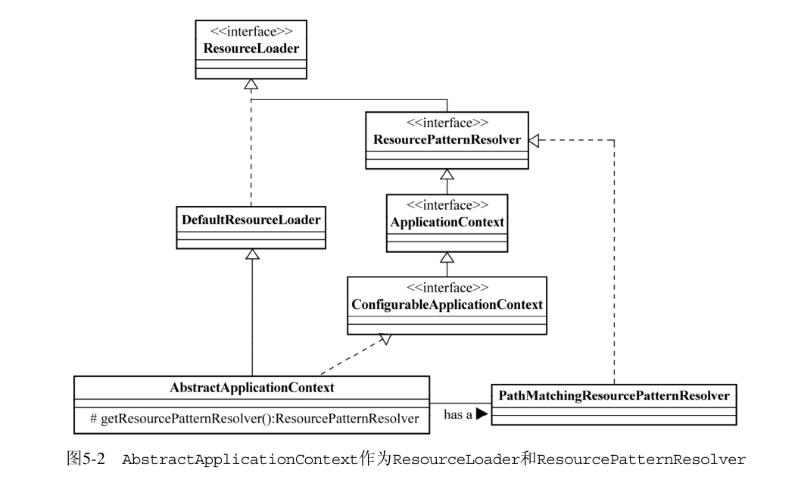

#  IOC

## IOC

### 注入方式

- **构造方法注入**

对象构造完成后，Bean 就可以被使用。此时 final 的作用就显现出来了。

访问 final 属性时，必须等待整个对象构造完成方可访问。

```java
private final IFXNewsListener newsListener;
private final IFXNewsPersister newsPersister; 

public FXNewsProvider(IFXNewsListener newsListner, IFXNewsPersister newsPersister) {
    this.newsListener = newsListner;
    this.newPersistener = newsPersister;
}
```

- **setter 方法注入**

setter 方法不用等待对象构造完成就可使用，相对宽松一些。

```java
private IFXNewsListener newsListener;
private IFXNewsPersister newPersistener;

public IFXNewsListener getNewsListener() {
	return newsListener;
}

public void setNewsListener(IFXNewsListener newsListener) {
	this.newsListener = newsListener;
}

public IFXNewsPersister getNewPersistener() {
	return newPersistener;
}

public void setNewPersistener(IFXNewsPersister newPersistener) {
	this.newPersistener = newPersistener;
}
```

- **接口注入**

接口注入比较死板和烦琐。如果需要注入依赖对象，被注入对象就必须声明和实现另外的接口。

- **三种注入方式的优缺点比较**

|      | 接口注入                                                     | 构造方法注入                                                 | setter 方法注入                                              |
| ---- | ------------------------------------------------------------ | ------------------------------------------------------------ | ------------------------------------------------------------ |
| 优点 | 无，不提倡使用                                               | 对象构造完成之后方可使用，可避免线程安全问题                 | 1. 方法可以命名，所以setter方法注入在描述性上要比构造方法注入好一些；<br />2. setter方法可以被继承，允许设置默认值。 |
| 缺点 | 强制被注入对象实现不必要的接口，带有侵入性；<br />而构造方法注入和 setter 方法注入则不需要如此。 | 1. 当依赖对象比较多的时候，构造方法的参数列表会比较长；<br />2. 构造方法无法被继承，无法设置默认值；<br />3. 通过反射构造对象的时候，对相同类型的参数的处理会比较困难。 | 对象无法在构造完成后马上进入就绪状态。容易引发线程安全问题   |

综上所述，构造方法注入和setter方法注入因为其侵入性较弱，且易于理解和使用，所以是现在使用最多的注入方式；而接口注入因为侵入性较强，近年来已经不流行了。

### 依赖管理

Ioc Service Provider不是人类，也就不能像酒吧服务生那样通过大脑来记忆和存储所有的相关信息。所以，它需要寻求其他方式来**记录**诸多对象之间的对应关系（依赖关系）。

Ioc 记录依赖关系的方式：

- **直接编码（硬编码）**

通过编码形式，绑定对象的关系信息，并将对象依赖注入到 Ioc 中。

```java
IoContainer container = ...;
// 似曾相识的 register
container.register(FXNewsProvider.class,new FXNewsProvider());
container.register(IFXNewsListener.class,new DowJonesNewsListener());

// 通过bind方法将“被注入对象”（由IFXNewsListenerCallable接口添加标志）所依赖的对象，
container.bind(IFXNewsListenerCallable.class, container.get(IFXNewsListener.class));

FXNewsProvider newsProvider = (FXNewsProvider)container.get(FXNewsProvider.class);
newProvider.getAndPersistNews();
```

- **配置文件方式（properties、XML）**

1. 编写 XML 文件

```xml
<bean id="newsProvider" class="..FXNewsProvider">
    <property name="newsListener">
        <ref bean="djNewsListener"/>
    </property>
    <property name="newPersistener">
        <ref bean="djNewsPersister"/>
    </property>
</bean>
<bean id="djNewsListener"
      class="..impl.DowJonesNewsListener">
</bean>
<bean id="djNewsPersister"
      class="..impl.DowJonesNewsPersister">
</bean>
```

2. 读取 XML 文件，从容器中获取组装完成的对象。

```java
container.readConfigurationFiles(...);
FXNewsProvider newsProvider = (FXNewsProvider)container.getBean("newsProvider");
newsProvider.getAndPersistNews();
```

- **元数据方式**

这种方式的代表实现是 Google Guice，这是 Bob Lee在 Java 5 的注解和 Generic 的基础上开发的一套 IoC 框架。我们可以直接在类中使用元数据信息来标注各个对象之间的依赖关系，然后由 Guice 框架根据这些注解所提供的信息将这些对象组装后，交给客户端对象使用。

```java
public class FXNewsProvider {
    private IFXNewsListener newsListener;
    private IFXNewsPersister newPersistener;
    
    // 通过 @Inject，我们指明需要 IoC Service Provider 通过构造方法注入方式
    @Inject
    public FXNewsProvider(IFXNewsListener listener,IFXNewsPersister persister) {
        this.newsListener = listener;
        this.newPersistener = persister;
    }
}

Injector injector = Guice.createInjector(new NewsBindingModule());
FXNewsProvider newsProvider = injector.getInstance(FXNewsProvider.class);
newsProvider.getAndPersistNews();
```

## Spring IOC

Spring 的 IOC 容器是一个提供 IOC 支持的轻量级容器，除了基本的 IOC 支持之外, Spring IOC 还提供了 AOP 框架支持、企业级服务集成等服务。


Spring IOC 提供两种容器类型：`BeanFactory`和`ApplicationContext`。

- **`BeanFactory`**
  1. 基础类型IOC容器，完整的IOC服务支持;
  2. 无指定时，默认延时初始化策略（lazy-load）;
  3. 也就是说Bean被访问时才对Bean进行初始化和依赖注入操作，容器开始启动较快。对于资源有限，并且功能要求不是很严格的场景，`BeanFactory`是比较合适的IOC容器选择。

- **`ApplicationContext`**
  1. `ApplicationContext`在`BeanFactory`基础上构建，提供完整的**`BeanFactory`**功能之外，还提供其他高级特性，如AOP，国际化，事件发布，容器上下文等；
  1. 默认容器启动时完成Bean的全部初始化和绑定；
  1. `ApplicationContext`比`BeanFactory`要求更多的系统资源，如果系统资源充足，`ApplicationContext`是比较合适的IOC容器选择。

-  `ApplicationContext` 与 `BeanFactory` 的类图


可以看到  `ApplicationContext` 继承于 `BeanFactory`，并且比 `BeanFactory` 多继承了一些接口，所以 `ApplicationContext` 功能丰富于 `BeanFactory`。

### BeanFactory

- 未拥有BeanFactory之前，获取Bean方式

```java
// 1. 设计FXNewsProvider类用于普遍的新闻处理 (容器，管理Bean和依赖)
public class FXNewsProvider {
    private IFXNewsListener newsListener;
    private IFXNewsPersister newPersistener;

    public FXNewsProvider(IFXNewsListener listener,IFXNewsPersister persister) {
        this.newsListener = listener;
        this.newPersistener = persister;
    }
}

// 2. 设计IFXNewsListener接口抽象各个新闻社不同的新闻获取方式，并给出相应实现类 (Bean的接口和实现类)
public interface IFXNewsListener {}
public class DowJonesNewsListener implements IFXNewsListener {}

// 3. 设计IFXNewsPersister接口抽象不同数据访问方式，并实现相应的实现类 (Bean的接口和实现类)
public interface IFXNewsPersister {}
public class DowJonesNewsPersister implements IFXNewsPersister {}

// 4. 实例化Bean
FXNewsProvider newsProvider = new FXNewsProvider();
newsProvider.getAndPersistNews();
```

- 拥有BeanFactory之后，获取Bean方式

1. 编写XML文件（或注解形式）

```xml
<beans>
    <bean id="djNewsProvider" class="..FXNewsProvider">
        <constructor-arg index="0">
            <ref bean="djNewsListener"/>
        </constructor-arg>
        <constructor-arg index="1">
            <ref bean="djNewsPersister"/>
        </constructor-arg>
    </bean>
</beans>
```

2. 获取Bean方式

```java
// 方式一
BeanFactory container = new XmlBeanFactory(new ClassPathResource("配置文件路径"));
FXNewsProvider newsProvider = (FXNewsProvider)container.getBean("djNewsProvider");
newsProvider.getAndPersistNews();

// 方式二
ApplicationContext container = new ClassPathXmlApplicationContext("配置文件路径");
FXNewsProvider newsProvider = (FXNewsProvider)container.getBean("djNewsProvider");
newsProvider.getAndPersistNews();

// 方式三
ApplicationContext container = new FileSystemXmlApplicationContext("配置文件路径");
FXNewsProvider newsProvider = (FXNewsProvider)container.getBean("djNewsProvider");
newsProvider.getAndPersistNews();
```

#### 注册与绑定方式


- **BeanFactory**：定义访问Bean的方式

- **BeanDefinitionRegistry**：担当Bean注册管理的角色

- **DefaultListableBeanFactory**：实现了`BeanFactory`和`BeanDefinitionRegistry`，继承他们的所有功能。

`BeanFactory`只是一个接口，我们最终需要一个该接口的实现来进行实际的Bean的管理，因此不同的`BeanFactory`实现类，承担不同的功能。

每一个受管的对象（Bean），在容器中都会有一个BeanDefinition的实例（instance）与之相对应，<u>该BeanDefinition的实例负责保存对象的所有必要信息，包括其对应的对象的class类型、是否是抽象类、构造方法参数以及其他属性等</u>。当客户端向BeanFactory请求相应对象的时候，BeanFactory通过这些信息为客户端返回一个完备可用的对象实例。

##### 1 直接编码方式

`com.wenqi.springioc.beanfactory.HardCodeRegisterAndBind`

##### 2 外部配置文件方式

Spring IOC支持两种配置文件格式：Properties和XML文件格式 (当然可以自定义文件格式，前提是需要)。

Spring IOC也提供了一个统一的配置文件处理方式：根据不同的配置文件格式，获取对应的`BeanDefinitionReader`实现类（如：`PropertiesBeanDefinitionReader`、`XmlBeanDefinitionReader`），由`BeanDefinitionReader`实现类负责将相应的配置文件内容读取并映射到`BeanDefinition`，然后将映射后的`BeanDefinition`注册到`BeanDefinitionRegistry`，之后`BeanDefinitionRegistry`完成Bean的注册和加载。对于`BeanDefinitionRegistry`来说，它只不过负责保管而已。

> Properties配置格式的加载

文件加载类：`org.springframework.beans.factory.support.PropertiesBeanDefinitionReader`

test：`com.wenqi.springioc.beanfactory.PropertiesRegisterAndBind`

> XML配置格式的加载

XML配置格式是Spring支持最完整，功能最强大的表达方式。当然，一方面这得益于XML良好的语意表达能力；另一方面，就是Spring框架从开始就自始至终保持XML配置加载的统一性

文件加载类：`org.springframework.beans.factory.xml.XmlBeanDefinitionReader`

test：`com.wenqi.springioc.beanfactory.XMLRegisterAndBind`

##### 3. 注解方式

编写配置类或配置的xml文件，扫描注解，注册/加载Bean。

test：`com.wenqi.springioc.beanfactory.AnnotationRegisterAndBind`

### XML

> 声明方式

- 1. Spring 2.0 版本之前基于DTD文档声明

```xml
<?xml version="1.0" encoding="UTF-8"?>
<!DOCTYPE beans PUBLIC "-//SPRING//DTD BEAN//EN" 
	"http://www.springframework.org/dtd/spring-beans.dtd">
<beans>
    
</beans>
```

- 2. Spring 2.0版本之后以继续使用DTD方式的DOCTYPE进行配置文件格式的限定，又引入了基于XML Schema的文档声明。

```xml
<beans xmlns="http://www.springframework.org/schema/beans"
       xmlns:xsi="http://www.w3.org/2001/XMLSchema-instance"
       xmlns:util="http://www.springframework.org/schema/util" 
       xmlns:jee="http://www.springframework.org/schema/jee" 
       xmlns:lang="http://www.springframework.org/schema/lang" 
       xmlns:aop="http://www.springframework.org/schema/aop" 
       xmlns:tx="http://www.springframework.org/schema/tx" 
       xsi:schemaLocation="http://www.springframework.org/schema/beans 
                           http://www.springframework.org/schema/beans/spring-beans-2.0.xsd 
                           http://www.springframework.org/schema/util 
                           http://www.springframework.org/schema/util/spring-util-2.0.xsd 
                           http://www.springframework.org/schema/jee 
                           http://www.springframework.org/schema/jee/spring-jee-2.0.xsd 
                           http://www.springframework.org/schema/lang 
                           http://www.springframework.org/schema/lang/spring-lang-2.0.xsd 
                           http://www.springframework.org/schema/aop 
                           http://www.springframework.org/schema/aop/spring-aop-2.0.xsd
                           http://www.springframework.org/schema/tx
                           http://www.springframework.org/schema/tx/spring-tx-2.0.xsd">
</beans>
```


#### beans

`<beans>` 是XML配置文件中最顶层的元素，它下面可以包含0或者1个 `<description>` 和多个 `<bean>` 以及 `<import>` 或者 `<alias>`。


> `<beans>`的属性值

`<beans>`标签属性，可以提取`<bean>`标签中的重合的设置，减少每个<bean>中指定的不必要工作。

1. **default-lazy-init**：默认false，是否对所有的 `<bean>` 进行延迟初始化；
2. **default-autowire：**可以取值为`no`, `byName`, `byType`, `constructor`以及`autodetect`。默认值为`no`，如果使用自动绑定的话，用来指定全体bean使用哪一种默认绑定方式；
3. **default-dependency-check**：可以取值`none`，`objects`，`simple`以及`all`。，默认值为none，即不做依赖检查；
4. **default-init-method：**如果`<bean>`中有相同的初始化方法，那么可以提取到`<beans>`中，统一指定方法；
5. **default-destroy-method：**如果`<bean>`中有相同的对象销毁方法，那么可以提取到`<beans>`中，统一指定方法；

> description/import/alias

通常情况下，这几个元素位于`<beans>`的下级，都不是必须的，仅作了解。

- **description**

**`<description>`**：在配置的文件中指定一些描述性的信息。通常情况下，该元素是省略的。

- **import**

通常情况下，可以根据模块功能或者层次关系，将配置信息分门别类地放到多个配置文件中。在想加载主要配置文件，并将主要配置文件所依赖的配置文件同时加载时，可以在这个主要的配置文件中通过`<import>`元素对其所依赖的配置文件进行引用。

即A.xml的bean引用了B.xml的bean，文件间相互引用，可以使用`<import>`进行引用。

```xml
<import resource="B.xml"/>
```

- **alias**

<bean>起别名。

```xml
<alias name="djNewsListener" alias="/news/djNewsListener"/>
<alias name="djNewsListener" alias="dowJonesNewsListener"/>
```

#### bean

```xml
<bean id="djNewsListener" 
      name="/news/djNewsListener,dowJonesNewsListener"
      class="..impl.DowJonesNewsListener">
</bean>
```

##### bean的属性

- **id**

每个注册到容器里的对象都需要唯一标识来区分开其他的bean，id属性来指定当前注册对象的beanName是什么。

并非任何情况下都需要指定每个`<bean>`的id，有些情况下，id可以省略，比如后面会提到的内部`<bean>`以及不需要根据
beanName明确依赖关系的场合等。

除了id指定标识外，使用name属性来指定`<bean>`的别名（alias）。与id属性相比，name属性的灵活之处在于，name可以使用id不能使用的一些字符，比如/。而且还可以通过逗号、空格或者冒号分割指定多个name。name的作用跟`<alias>`标签作用相同。

- **class**

每个注册到容器的对象都需要通过`<bean>`元素的class属性指定其类型，否则，容器可不知道这个对象到底是何方神圣。在大部分情况下，<u>该属性是必须的</u>。仅在少数情况下不需要指定，如后面将提到的在使用抽象配置模板的情况下

##### 相互依赖的bean

更多时候，Bean之间是相互依赖，共同协作构建的。下面看一下Spring的IoC容器的XML配置中，应该如何表达这种依赖性。

> 构建方法注入

```xml
<bean id="djNewsProvider" class="..FXNewsProvider">
    <constructor-arg>
        <ref bean="djNewsListener"/>
    </constructor-arg>
    <constructor-arg>
        <ref bean="djNewsPersister"/>
    </constructor-arg>
</bean>

<!-- 另一种表达方式 -->
<bean id="djNewsProvider" class="..FXNewsProvider">
    <constructor-arg ref="djNewsListener"/>
    <constructor-arg ref="djNewsPersister"/>
</bean>
```

通过构造方法注入依赖对象时，可以使用标签`<constructor-arg>`。使用`<ref>`来指明容器将要引入的Bean实例。

<!-- 关于<constructor-arg> -->

有的时候对象具有多个构造方法， 仅仅使用`<constructor-arg ref="djNewsListener"/>`是无法准确找到对应的构造方法（寻找构造方法时，仅会找第一个符合的构造方法来注入）。这时需要引入`<constructor-arg/>`的type属性，用来标注特定的构造方法。

test：`com.wenqi.springioc.xml.ConstructArgInjectXmlTest`

- 指定type属性
- 指定index属性

> setter方法注入

通过setter方法注入依赖对象时，可以使用标签`<property>`。``<property>``提供一个name属性，用来指定注入Bean对应的实例变量名。之后通过`<ref>`或`<value>`来指定具体依赖的对象或值。

其中`<constructor-arg>`和`<property>`可以同时配合使用。

```xml
<bean id="djNewsProvider" class="..FXNewsProvider">
    <property name="newsListener">
        <ref bean="djNewsListener"/>
    </property>
    <property name="newPersistener">
        <ref bean="djNewsPersister"/>
    </property>
</bean>

<!-- 另一种表达形式 -->
<bean id="djNewsProvider" class="..FXNewsProvider">
    <property name="newsListener" ref="djNewsListener"/>
    <property name="newPersistener" ref="djNewsPersister"/>
</bean>
```

> `<property>`和`<constructor-arg>`中可用的配置项

Spring 提供了其他元素供使用：bean、ref、idref、value、null、list、set、map、props。

- value

可以使用type来指定原始类型及其包装类型。

```xml
<constructor-arg value="111111"/>
<property name="attributeName" value="222222"/>
```

- ref

通过ref的local、parent和bean属性来指定引用的对象的beanName是什么，ref没有子元素。

1. local：指定与当前配置再同一个配置文件的对象定义的名称（可以获得XML解析器的id约束验证支持）
2. parent：则只能指定位于当前容器的父容器中定义的对象引用；
3. bean：则基本上通吃，所以，通常情况下，直接使用bean来指定对象引用就可以了。

```xml
<constructor-arg>
    <ref local="djNewsPersister"/>
</constructor-arg>

<constructor-arg>
    <ref parent="djNewsPersister"/>
</constructor-arg>

<constructor-arg>
    <ref bean="djNewsPersister"/>
</constructor-arg>
```

==注意：== BeanFactory可以分层次（通过实现`HierarchicalBeanFactory`接口），容器A在初始化的时候，可以首先加载容器B中的所有对象定义，然后再加载自身的对象定义，这样，容器B就成为了容器A的父容器，容器A可以引用容器B中的所有对象定义：

```java
BeanFactory parentContainer = new XmlBeanFactory(new ClassPathResource("父容器配置文件路径"));
BeanFactory childContainer = new XmlBeanFactory(new ClassPathResource("子容器配置文件路径"), parentContainer);
```

childContainer中定义的对象，如果通过parent指定依赖，则只能引用parentContainer中的对象定义。

- idref

为当前对象注入所依赖的对象的名称，而不是引用，使用标签`<value>`和`<idref>`均可。

使用idref才是最为合适的。因为使用idref，容器在解析配置的时候就可以帮你检查这个beanName到底是否存在，而不用等到运行时才发现这个beanName对应的对象实例不存在。

```xml
<!-- 为属性newsListenerBeanName注入bean djNewsListener 两种形式都可以，使用idref更合理 -->
<property name="newsListenerBeanName">
    <idref bean="djNewsListener"/>
</property>

<property name="newsListenerBeanName">
    <value>djNewsListener</value>
</property>
```

- 内部bean

有时我们所依赖的bean A只会被另一个Bean B引用，或者bean A定义我们不想其他对象通过`<ref>`引用到它，这时候可以使用内嵌形式构建内部bean A来防止其他bean引用。如果其他bean需要引用这个beanA，那么可以考虑将bean A独立定义。

一般来说内部bean是不需要指定id的。

```xml
<bean id="djNewsProvider" class="..FXNewsProvider">
    <constructor-arg index="0">
        <bean class="..impl.DowJonesNewsListener">
        </bean>
    </constructor-arg>
    <constructor-arg index="1">
        <ref bean="djNewsPersister"/>
    </constructor-arg>
</bean>
```

- list

`<list>`对应注入对象类型为java.util.List及其子类或者数组类型的依赖对象，有序注入。

```java
public class MockDemoObject {
    private List param1;
    private String[] param2;
    private Set valueSet;
    private Map mapping;
    // 相应的setter和getter方法
}
```

```xml
<property name="param1">
    <list>
        <value> something</value>
        <ref bean="someBeanName"/>
        <bean class="..."/>
    </list>
</property>
<property name="param2">
    <list>
        <value>stringValue1</value>
        <value>stringValue2</value>
    </list>
</property>
```

- set

`<set>`对应注入Java Collection中类型为java.util.Set或者其子类的依赖对象，无序注入。

```xml
<property name="valueSet">
    <set>
        <value> something</value>
        <ref bean="someBeanName"/>
        <bean class="..."/>
        <list>
            ...
        </list>
    </set>
</property>
```

- map

与列表（list）使用数字下标来标识元素不同，映射（map）可以通过指定的键（key）来获取相应的值。对应注入java.util.Map或者其子类类型的依赖对象。

每一个`<entry>`都需要为其指定一个键和一个值，key属性用于指定通常的简单类型的键，而key-ref则用于指定对象的引用作为键。

```xml
<property name="mapping">
    <map>
        <entry key="strValueKey">
            <value>something</value>
        </entry>
        <entry>
            <key>objectKey</key>
            <ref bean="someObject"/>
        </entry>
        <entry key-ref="listKey">
            <list>
                ...
            </list>
        </entry>
    </map>
</property>

<!-- 简化写法 -->
<property name="valueSet">
    <map>
        <entry key="strValueKey" value="something"/>
        <entry key-ref="" value-ref="someObject"/>
        <entry key-ref="listKey">
            <list>
                ...
            </list>
        </entry>
    </map>
</property>
```

==警告：==往list，set，map注入不同类型的对象虽然很爽，用起来分分钟报`ClassCastException`。

- props

`<props>`是简化后了的<map>，或者说是特殊化的map，该元素对应配置类型为java.util.Properties的对象依赖。因为Properties只能指定String类型的键（key）和值

```java
public class MockDemoObject{
    private Properties emailAddrs;
    // 必要的setter和getter方法
}
```

```xml
<property name="valueSet">
    <props>
        <prop key="author">fujohnwang@gmail.com</prop>
        <prop key="support">support@spring21.cn</prop>
    </props>
</property>
```

- null

为属性注入null值，比如String不指定value的话，默认生成“”。若有属性为null，则可以使用`<null/>`

```java
public class MockDemoObject{
    private String param1;
    private Object param2;
    // 必要的setter和getter方法
}
```

```XML
<property name="param1">
    <null/>
</property>
<property name="param2">
    <null/>
</property>

<!-- 
// 实际上就相当于
public class MockDemoObject{
    private String param1 = null;
    private Object param2 = null;
    // 必要的setter和getter方法
}
-->
```

> depend on

容器在初始化当前bean定义时，会根据这些元素所标记的依赖关系，首先实例化当前bean定义所依赖其他bean定义。如果某些时候，我们没有通过类似`<ref>`的元素明确指定对象A依赖与对象B时，我们可以使用`depend on`属性来指定依赖关系。

假设ClassA需要使用log4j，那么ClassA在bean定义时必须在容器初始化自身实例时，先实例化log4j相关的模块（SystemConfigurationSetup），如下所示：

```java
public class SystemConfigurationSetup {
  static
  {
    DOMConfigurator.configure("配置文件路径");
    // 其他初始化代码
  }
}
```

```xml
<bean id="classAInstance" class="...ClassA" depends-on="configSetup"/>
<bean id="configSetup" class="SystemConfigurationSetup"/>

<!-- 如果ClassA依赖多个实例 -->
<bean id="classAInstance" class="...ClassA" depends-on="configSetup,configSetup2,..."/>
<bean id="configSetup" class="SystemConfigurationSetup"/>
<bean id="configSetup2" class="SystemConfigurationSetup2"/>
```

> 自动绑定 autowire

上述都是手动指定bean的依赖关系进行绑定。下面来介绍一下`<bean>`提供autowire属性，自动绑定某些bean。Spring提供了5中自动绑定模式：

- no：默认模式，不采用任何形式的自动绑定，完全依赖手工配置

```xml
<!-- 以下两种写法是等效的 -->
<bean id="beanName" class="..."/>
<bean id="beanName" class="..." autowire="no"/>
```

- byName：

按照类声明的实例变量的名称，与bean定义的beanName的值进行匹配，符合的bean定义将被自动绑定到当前的实例变量上。

如下：xml定义了bean emphasisAttribute，同时Foo的属性名为emphasisAttribute，同时符合才进行自动绑定。

```java
public class Foo {
  private Bar emphasisAttribute;
  // 相应的setter方法定义
}

public class Bar {
}
```

```xml
<bean id="fooBean" class="...Foo" autowire="byName"></bean>
<bean id="emphasisAttribute" class="...Bar"></bean>
```

- byType

如果指定当前Bean定义的autowire模式为byType，那么容器会根据当前bean定义类型，分析依赖对象类型，然后到容器中查找所有的bean并找到与依赖对象类型相同的bean定义，然后将该bean自动绑定到定义的bean中。

byName和byType的演示是相同的，只不过将`autowire="byName"`换成`autowire="byType"`

- constructor

byName和byType类型的自动绑定模式是针对property的自动绑定，而constructor类型是针对构造方法的类型进行的自动绑定，而不是实例属性的类型，绑定模式是byType类型。

```java
public class Foo {
  private Bar bar;
  public Foo(Bar arg) {
    this.bar = arg;
  }
}

public class Bar {
}
```

```xml
<bean id="foo" class="...Foo" autowire="constructor"></bean>
<bean id="bar" class="...Bar"></bean>
```

- autodetect

这种模式是byType和constructor模式的结合体，如果对象拥有默认无参数的构造方法，容器会优先考虑byType的自动绑定模式。否则，会使用constructor模式。当然，如果通过构造方法注入绑定后还有其他属性没有绑定，容器也会使用byType对剩余的对象属性进行自动绑定。

> 手动指定绑定关系 or 自动绑定关系？

- 优点：

1. 自动绑定可以减少手动配置的繁琐；
2. 自动绑定在添加新的依赖时，无需手动更改配置信息。

- 缺点：

1. 自动绑定不如指定绑定的依赖关系一目了然；
2. 会出现一些不可预知行为（不过启动阶段可以发现，问题不大）。比如使用byType时，新增了一个相同类型的bean定义；使用byName是，新增相同的beanName或者替换了等等；
3. 自动绑定Spring IDE的支持不是很友好。

==注意：== 

1. 手工明确指定的绑定关系总会覆盖自动绑定模式的行为；
2. 自动绑定只应用与**原生类型、String类型和Classes类型之外**的对象类型，对于原生类型、String类型和Classes类型以及这些类型的数组，应用自动绑定类型是无效的。

> dependency-check

`<bean>`的dependency-check属性对其所依赖的对象进行最终检查，该功能主要与自动绑定结合使用，可以保证当自动绑定完成后，最终确认每个对象所依赖的对象是否按照所预期的那样被注入。

- none：默认，不做依赖检查；
- simple：对简单属性类型以及相关的collection进行依赖检查，对象引用类型的依赖除外；
- object：只对对象引用类型依赖进行检查；
- all：simple和object相结合，基本上是所有类型。

> lazy-init

我们直到ApplicationContext容器启动时会对所有的bean进行实例化，如果我们不想某些bean启动时进行实例化，这时`lazy-init`就派上用场了。

指定了`lazy-init`不一定按照我们的预期生效，如下，当`lazy-init-bean`被`not-lazy-init-bean`所依赖时，`lazy-init-bean`并不会延迟初始化。

```xml
<bean id="lazy-init-bean" class="..." lazy-init="true"/>
<bean id="not-lazy-init-bean" class="...">
  <property name="propName">
    <ref bean="lazy-init-bean"/>
  </property>
</bean>
```

> 继承: parent属性

parent属性与abstract属性结合使用，达到将响应bean定义模板化的目的。

```xml
<bean id="newsProviderTemplate" abstract="true">
  <property name="newPersistener">
    <ref bean="djNewsPersister"/>
  </property>
</bean>

<bean id="superNewsProvider" parent="newsProviderTemplate" class="..FXNewsProvider">
  <property name="newsListener">
    <ref bean="djNewsListener"/>
  </property>
</bean>

<bean id="subNewsProvider" parent="newsProviderTemplate" class="..SpecificFXNewsProvider">
  <property name="newsListener">
    <ref bean="specificNewsListener"/>
  </property>
</bean>
```

newsProviderTemplate的bean定义通过abstract属性声明为true，说明这个bean定义不需要实例化。该bean定义只是一个配置模板，不对应任何对象。`superNewsProvider`和`subNewsProvider`通过parent指向这个模板定义，就拥有了该模板定义的所有属性配置。

> scope

scope：作用域，包含singleton、prototype，其中request、session和global session类型只能再Web应用中使用。

- singleton

默认的scope，在Spring IOC容器中只存在一个实例，所有对该对象的引用将共享这个实例。生命周期是从容器启动，到它第一次被请求而实例化开始，只要容器不销毁或者退出，该类型bean的单一实例就会一直存活。

```xml
<!-- DTD or XSD -->
<bean id="mockObject1" class="...MockBusinessObject"/>
<!-- DTD -->
<bean id="mockObject1" class="...MockBusinessObject" singleton="true"/>
<!-- XSD -->
< bean id="mockObject1" class="...MockBusinessObject" scope="singleton"/>
```

- prototype

容器在接到该类型对象的请求的时候，会每次都重新生成一个新的对象实例给请求方。

prototype类型的对象的实例化以及属性设置等工作都是由容器负责的，但是只要准备完毕，并且对象实例返回给请求方之后，容器就不再拥有当前返回对象的引用，**请求方需要自己负责当前返回对象的后继生命周期的管理工作，包括该对象的销毁**。

```xml
<!-- DTD -->
<bean id="mockObject1" class="...MockBusinessObject" singleton="false"/>
<!-- XSD -->
<bean id="mockObject1" class="...MockBusinessObject" scope="prototype"/>
```

- request

Spring容器，即XmlWebApplicationContext会为每个HTTP请求创建一个全新的Request-Processor对象供当前请求使用，当请求结束后，该对象实例的生命周期即告结束。

```xml
<bean id="requestProcessor" class="...RequestProcessor" scope="request"/>
```

- session

Spring容器会为每个独立的session创建属于它们自己的全新的UserPreferences对象实例。与
request相比，除了拥有session scope的bean的实例具有比request scope的bean可能更长的存活时间，其他方面真是没什么差别。

```xml
<bean id="userPreferences" class="com.foo.UserPreferences" scope="session"/>
```

- global session

global session只有应用在基于portlet的Web应用程序中才有意义，它映射到portlet的global范围的
session。如果在普通的基于servlet的Web应用中使用了这个类型的scope，容器会将其作为普通的session类型的scope对待。

```xml
<bean id="userPreferences" class="com.foo.UserPreferences" scope="globalSession"/>
```

- 自定义scope类型

1. 实现`org.springframework.beans.factory.config.Scope`接口，必须实现get和remove方法；
2. 将自定义实现的`com.wenqi.springioc.instance.xml.scope.ThreadScope`注册到容器中；

```java
Scope threadScope = new ThreadScope();
beanFactory.registerScope("thread", threadScope);
```

3. 使用自定义的scope

```xml
<bean id="beanName" class="..." scope="thread"/>
```

除此之外，Spring还专门提供了用于同意注册自定义Scope的实现：`org.springframework.beans.factory.config.CustomScopeConfigurer`

```xml
<bean class="org.springframework.beans.factory.config.CustomScopeConfigurer">
  <property name="scopes">
    <map>
      <entry key="thread" value="com.wenqi.springioc.instance.xml.scope.ThreadScope"/>
    </map>
  </property>
</bean>

<bean id="beanName" class="..." scope="thread">
  <aop:scoped-proxy/>
</bean>
```

#### 工厂方法

很多时候我们需要依赖第三方库，并且需要实例化相关类。此时我们可以通过工厂方法（Factory Method）模式，提供一个工厂类来是实例具体的接口实现类。这时当实现类有变更的话，只需要修改工厂方法类，而使用对象不需要改动，做到接口鱼实现类解耦。

##### 静态工厂

`com.wenqi.springioc.instance.xml.factory.StaticBarInterfaceFactory`

```xml
<bean id="bar" class="com.wenqi.springioc.instance.xml.factory.StaticBarInterfaceFactory" factory-method="getInstance"/>
```

class指定静态方法工厂类，factory-method指定工厂方法名称，然后，容器调用该静态方法工厂类的指定工厂方法（getInstance），并返回方法调用后的结果，即BarInterfaceImpl的实例。

##### 非静态工厂

`com.wenqi.springioc.instance.xml.factory.NoStaticBarInterfaceFactory`

```xml
<bean id="fooNoStatic" class="com.wenqi.springioc.instance.xml.factory.Foo">
  <property name="barInterface" ref="bar"/>
</bean>
<!-- NoStaticBarInterfaceFactory 作为正常的bean注入容器中 -->
<bean id="barFactory" class="com.wenqi.springioc.instance.xml.factory.NoStaticBarInterfaceFactory"/>
<bean id="barNoStatic" factory-bean="barFactory" factory-method="getInstance"/>
```

NonStaticBarInterfaceFactory是作为正常的bean注册到容器的，而barNoStatic的定义则与静态工厂方法的定义有些不同。现在使用factory-bean属性来指定工厂方法所在的工厂类实例，而不是通过class属性来指定工厂方法所在类的类型。

如果barFactory带参数，处理方法与静态工厂处理方法一致。

##### FactoryBean

FactoryBean是Spring容器提供的一种可以扩展容器对象实例化逻辑的接口，请不要将其与容器名称BeanFactory相混淆。FactoryBean，其主语是Bean，定语为Factory，也就是说，它本身与其他注册到容器的对象一样，只是一个Bean而已，只不过，这种类型的Bean本身就是生产对象的工厂（Factory）。

当某些对象的实例化过程过于烦琐，通过XML配置过于复杂，或者，某些第三方库不能直接注册到Spring容器的时候，就可以实现`org.spring.framework.beans.factory.FactoryBean`接口，给出自己的对象实例化逻辑代码。相当于Spring为我们提供了Bean实例化的标准步骤。

```java
public interface FactoryBean {
  // 返回Factory生产的实例
  Object getObject() throws Exception;
  
  // 返回getObject()方法所返回的对象的类型，如果预先无法确定，则返回null
  Class getObjectType();
  
  // 是否要以singleton形式存在于容器中
  boolean isSingleton();
}
```

- 示例

`com.wenqi.springioc.instance.xml.factory.factorybean.NextDayDateFactoryBean`

FactoryBean类型的bean定义，通过正常的id引用，容器返回BeanFactory的是FactoryBean所“生产”的对象类型，而非FactoryBean实现本身。如果一定要取得FactoryBean本身的话，可以通过在bean定义的id之前加前缀&来达到目的。

```txt
// 一些比较常见的FactoryBean实现
JndiObjectFactoryBean
LocalSessionFactoryBean
SqlMapClientFactoryBean
ProxyFactoryBean
TransactionProxyFactoryBean
```

#### 方法注入/替换

方法注入（Method Injection）以及方法替换（Method Replacement）

延申问题：为什么scope类型是prototype，对象调用同一个方法都是同一个bean？

`com.wenqi.springioc.instance.method.MethodInjectDemo`

解析：当Bean的属性第一个实例注入之后，该Bean再也没有重新向容器申请新的实例，所以Bean的属性都是同一个应用，无论该属性是singleton还是prototype。

如果想要每次获取的属性都重新创建一个新的实例，可以参考一下方法：

1. 方法注入（Cglib动态生成一个子类实现，从而替代当前对象，重写方法）

```xml
<lookup-method name="getNewsBean" bean="newsBean"/>
```

2. 每次从容器中获取

```txt
# 实现接口
org.springframework.beans.factory.BeanFactoryAware
org.springframework.beans.factory.config.ObjectFactoryCreatingFactoryBean
org.springframework.beans.factory.config.ServiceLocatorFactoryBean
```

3. 方法替换

```xml
<replaced-method name="getAndPersistNews" replacer="fXNewsProviderMethodReplacer"/>
```


### 容器


#### 容器启动

容器启动时，首先加载**Configuration MetaData**（借助工具类BeanDefinitionReader），并对其进行解析和分析，组装成bean定义的必要信息**BeanDefinition**，并注册到相应的**BeanDefinitionRegistry**，此时容器启动工作就完成了。

- 容器启动时，我可以干

Spring提供了一种叫做BeanFactoryPostProcessor的容器扩展机制。该机制允许我们在容器实例化相应对象之前，对注册到容器的BeanDefinition所保存的信息做相应的修改。这就相当于在容器实现的第一阶段最后加入一道工序，让我们对最终的BeanDefinition做一些额外的操作，比如修改其中bean定义的某些属性，为bean定义增加其他信息等。

- 借助Spring提供的BeanFactoryPostProcessor实现

> PropertyPlaceholderConfigurer

我们不想一些业务的配置信息混合到spring xml配置中，希望把这些信息放到统一的properties文件中集中管理。PropertyPlaceholderConfigurer允许我们在XML配置文件中使用占位符（PlaceHolder），即`${}`

**plus:**

PropertyPlaceholderConfigurer不仅可以从properties文件中加载配置项，同时还会检查Java的System类中的Properties，可以通过setSystemPropertiesMode()或者setSystemProper-tiesModeName()来控制是否加载或者覆盖System相应Properties的行为。

```java
/** Never check system properties. */
public static final int SYSTEM_PROPERTIES_MODE_NEVER = 0;

/**
 * Check system properties if not resolvable in the specified properties.
 * This is the default.
 */
public static final int SYSTEM_PROPERTIES_MODE_FALLBACK = 1;

/**
 * Check system properties first, before trying the specified properties.
 * This allows system properties to override any other property source.
 */
public static final int SYSTEM_PROPERTIES_MODE_OVERRIDE = 2;
```

> PropertyOverrideConfigurer

当我们想要用自定义的配置项来覆盖xml定义的配置项，这时可以使用`PropertyOverrideConfigurer`。

比如：

1. 定义properties文件
2. 语法：beanName.propertyName
3. 多行则最后一行生效

```properties
beanName.propertyName=value
```

> CustomEditorConfigurer

`PropertyPlaceholderConfigurer`和`PropertyOverrideConfigurer`都是通过修改`BeanDefinition`中的属性来达到目的。`CustomEditorConfigurer`只是辅助性地将后期会用到的信息注册到容器，对BeanDefinition没有做任何变动。

我们知道定义的xml/properties等配置只是字符串解析到`BeanDefinition`，但是我们使用Bean时需要的是一个个不同类型的对象，这时候Spring就自动完成类型转换相关的动作。当我们需要指定特定类型转换时，我们可以通过CustomEditorConfigurer告知容器，以便容器在适当的时机使用到适当的PropertyEditor。

```txt
// spring提供的部分PropertyEditor
StringArrayPropertyEditor
ClassEditor
FileEditor
```

**Plus：**

-> 自定义PropertyEditor，需要对yyyy/MM/dd形式的日期格式转换提供支持。

`com.wenqi.springioc.postprocessor.DatePropertyEditor`

#### Bean实例化阶段

当某个请求通过容器的getBean请求对象时，或者因依赖关系容器需要隐式地调用getBean方法时，就会触发Bean的实例化。

首先容器会首先检查所请求的对象之前是否已经初始化。如果没有，则会根据注册的BeanDefinition所提供的信息实例化被请求对象，并为其注入依赖。如果该对象实现了某些回调接口，也会根据回调接口的要求来装配它。当该对象装配完毕之后，容器会立即将其返回请求方使用。

**注：**BeanFactory在getBean时实例化Bean，而ApplicationContext在启动时就初始化bean。


> 设置对象属性

BeanWrapper接口可对bean实例操作，免去直接使用Java反射API。

> 检查Aware接口

当<u>对象实例化完成并且相关属性以及依赖设置完成之后</u>，Spring容器会检查当前对象实例是否实现了一系列的以Aware命名结尾的接口定义。如果是，则将这些**Aware接口定义中规定**的依赖注入给 Spring 的 IoC 容器当前对象实例。

每个Aware接口定义不一样，实现的作用也不同。比如：

- for BeanFactory

org.springframework.beans.factory.BeanNameAware：设置当前Bean的BeanName，注入容器中；

org.springframework.beans.factory.BeanClassLoaderAware：设置当前Bean的ClassLoader，注入容器中；

org.springframework.beans.factory.BeanFactoryAware：设置当前Bean的BeanFactory容器引用，注入容器中。（这样，当前对象实例就拥有了一个BeanFactory容器的引用，并且可以对这个容器内允许访问的对象按照需要进行访问。）

- for ApplicationContext

org.springframework.context.ResourceLoaderAware

org.springframework.context.ApplicationEventPublisherAware

org.springframework.context.MessageSourceAware

org.springframework.context.ApplicationContextAware

> BeanPostProcessor

- BeanPostProcessor & BeanFactoryPostProcessor

BeanPostProcessor：存在于对象实例化阶段，处理容器内所有符合条件的实例化后的对象实例。

BeanFactoryPostProcessor：存在于容器启动阶段，处理容器内所有符合条件的BeanDefinition。

- 作用

```java
public interface BeanPostProcessor {
  Object postProcessBeforeInitialization(Object bean, String beanName) throws BeansException;
  Object postProcessAfterInitialization(Object bean, String beanName) throws BeansException;
}
```

上述接口定义的两个方法，都传入实例化的对象bean和beanName，这时在bean实例化过程中我们可以很便利对传入的对象实例进行一些扩展操作。

**==常用场景：==**Spring的AOP则利用BeanPostProcessor来为对象生成相应的代理对象

上述ApplicationContext对应对应的那些Aware接口实际上就是通过BeanPostProcessor的方式进行处理的。当ApplicationContext中每个对象的实例化过程走到BeanPostProcessor前置处理这一步时，ApplicationContext容器会检测到之前注册到容器的`ApplicationContextAwareProcessor`这个BeanPostProcessor的实现类，然后就会调用其`postProcessBeforeInitialization()`方法，检查并设置Aware相关依赖。

```java
class ApplicationContextAwareProcessor implements BeanPostProcessor {

  private final ConfigurableApplicationContext applicationContext;

  private final StringValueResolver embeddedValueResolver;


  /**
	 * Create a new ApplicationContextAwareProcessor for the given context.
	 */
  public ApplicationContextAwareProcessor(ConfigurableApplicationContext applicationContext) {
    this.applicationContext = applicationContext;
    this.embeddedValueResolver = new EmbeddedValueResolver(applicationContext.getBeanFactory());
  }


  @Override
  @Nullable
  public Object postProcessBeforeInitialization(Object bean, String beanName) throws BeansException {
    if (!(bean instanceof EnvironmentAware || bean instanceof EmbeddedValueResolverAware ||
          bean instanceof ResourceLoaderAware || bean instanceof ApplicationEventPublisherAware ||
          bean instanceof MessageSourceAware || bean instanceof ApplicationContextAware)){
      return bean;
    }

    AccessControlContext acc = null;

    if (System.getSecurityManager() != null) {
      acc = this.applicationContext.getBeanFactory().getAccessControlContext();
    }

    if (acc != null) {
      AccessController.doPrivileged((PrivilegedAction<Object>) () -> {
        invokeAwareInterfaces(bean);
        return null;
      }, acc);
    }
    else {
      invokeAwareInterfaces(bean);
    }

    return bean;
  }

  private void invokeAwareInterfaces(Object bean) {
    if (bean instanceof EnvironmentAware) {
      ((EnvironmentAware) bean).setEnvironment(this.applicationContext.getEnvironment());
    }
    if (bean instanceof EmbeddedValueResolverAware) {
      ((EmbeddedValueResolverAware) bean).setEmbeddedValueResolver(this.embeddedValueResolver);
    }
    if (bean instanceof ResourceLoaderAware) {
      ((ResourceLoaderAware) bean).setResourceLoader(this.applicationContext);
    }
    if (bean instanceof ApplicationEventPublisherAware) {
      ((ApplicationEventPublisherAware) bean).setApplicationEventPublisher(this.applicationContext);
    }
    if (bean instanceof MessageSourceAware) {
      ((MessageSourceAware) bean).setMessageSource(this.applicationContext);
    }
    if (bean instanceof ApplicationContextAware) {
      ((ApplicationContextAware) bean).setApplicationContext(this.applicationContext);
    }
  }

}
```

- 自定义BeanPostProcessor

场景：从服务器A中获取加密连接密码，然后解密并使用密码登录服务器B。利用BeanPostProcessor特性，进行解密操作。

1. 自定义BeanPostProcessor，`com.wenqi.springioc.instance.PasswordDecodePostProcessor`
2. 将其注册到容器中(`@Component`或`<bean>`)

> InitializingBean和init-method

当检查完BeanPostProcessor的前置处理之后，接下来检测当前对象是否实现了`InitializingBean`接口，如果是，则会调用其`afterPropertiesSet()`方法进一步调整对象实例的状态。类似地，在XML配置的时候，使用`<bean>`的`init-method`属性可以达到相同效果。

> DisposableBean与destroy-method

当容器完成上述流程之后，容器将检查singleton类型的bean实例，看是否实现了接口`org.springframework.beans.factory.DisposableBean`或其对应的bean定义是否通过`<bean>`的`destroy-method`属性指定了自定义的对象销毁方法。

如果有，则就会为该实例注册一个用于对象销毁的回调（Callback），以便在这些singleton类型的对象实例销毁之前，执行回调方法中的销毁逻辑。

==常用场景：==数据库连接池的销毁

- demo

com.wenqi.springioc.instance.destory.ApplicationLauncher

注： 销毁的都是singleton的bean，prototype的bean生命周期已经交给使用对象管理了

1. BeanFactory销毁调用`container.destroySingletons()`
2. ApplicationContext销毁调用`container.registerShutdownHook()`

### ApplicationContext


ApplicationContext的常用实现：

1. `org.springframework.context.support.FileSystemXmlApplicationContext：`在默认情况下，从文件系统加载Bean定义以及相关资源的ApplicationContext实现。
2. `org.springframework.context.support.ClassPathXmlApplicationContext：`在默认情况下，从ClassPath加载Bean定义以及相关资源的ApplicationContext实现。
3. `org.springframework.web.context.support.XmlWebApplicationContext:`Spring提供的用于Web应用程序的AplicationContext实现。

#### 统一资源加载

资源定义比较广泛且抽象，能够以任何的形式（如：二进制对象形式、字节流形式、文件形式等），存在于任何的地方（如：文件系统、Classpath路径下、指定URL定位地方）。当我们进行资源查找和资源定位时，就会衍生出各种五花八门的实现类。此时，急需一种抽象和实现类来统一上述资源的多样化，对外提供统一的抽象接口并对使用者时透明的。

为此，Spring提供了基于`org.springframework.core.io.Resource`和`org.springframework.core.io.ResourceLoader`接口的资源抽象和加载策略


##### Resource

org.springframework.core.io.Resource：作为所有资源的抽象和访问接口，常用的实现类如：

1. `org.springframework.core.io.ByteArrayResource`：将字节数组（byte）提供的数据作为一种资源进行封装。如果通过InputStream形式访问该类型的资源，该实现会根据字节数组的数据，构造相应的ByteArrayInputStream并返回；

```java
@Override
public InputStream getInputStream() throws IOException {
    return new ByteArrayInputStream(this.byteArray);
}
```

2. `org.springframework.core.io.ClassPathResource`：从Java应用程序的ClassPath中加载具体资源并进行封装，同时也可以指定的类加载器（ClassLoader）或者指定的类进行资源加载；
3. `org.springframework.core.io.UrlResource`：通过java.net.URL进行的具体资源查找定位的实现类，内部委派URL进行具体的资源操作。
4. `org.springframework.core.io.InputStreamResource`：将给定的InputStream视为一种资源的Resource实现类，较为少用。可能的情况下，以ByteArrayResource以及其他形式资源实现代之。

- 自定义Resource

可以考虑实现`org.springframework.core.io.Resource`，更为方便地是继承于抽象类`org.springframework.core.io.AbstractResource`。

##### ResourceLoader

org.springframework.core.io.ResourceLoader：是资源查找定位策略的统一抽象，具体的资源查找定位策略则由相应的ResourceLoader实现类给出。常用的ResourceLoader如下：

> DefaultResourceLoader

`org.springframework.core.io.DefaultResourceLoader#getResource`，其资源查找处理逻辑：

1. 检查资源路径是否以classpath:前缀打头，如果是，则尝试构造`ClassPathResource`类型资源并返回；

2. 检查其他方式定位资源：
   1. 尝试通过URL，根据指定有协议前缀的资源路径来定位资源，有则构造`FileUrlResource/UrlResource`返回，没有则抛出`MalformedURLException`，进入降级流程；
   2. 降级流程（`getResourceByPath`）：构造`ClassPathContextResource extends ClassPathResource`类型的资源返回。

示例：com.wenqi.springioc.applicationcontext.resource.DefaultResourceLoaderDemo

> FileSystemResourceLoader

FileSystemResourceLoader extends DefaultResourceLoader，主要是重写了定位资源的降级流程（`getResourceByPath`）。如果我们希望从文件系统加载资源并以FileSystemResource类型返回，此时需要使用的`FileSystemResourceLoader`代替默认的`DefaultResourceLoader`。

注：不同的ResourceLoader，加载出来的Resource也有所差别，具体可参考：

- org.springframework.core.io.ClassPathResource
- org.springframework.core.io.FileSystemResource

示例：com.wenqi.springioc.applicationcontext.resource.FileSystemResourceLoaderDemo

##### ResourcePatternResolver

`ResourcePatternResolver extends ResourceLoader`是ResourceLoader的扩展，ResourceLoader每次只能根据资源路径返回确定的单个Resource实例，而ResourcePatternResolver则可以根据指定的资源路径匹配模式，每次返回多个Resource实例。

常用实现类：`org.springframework.core.io.support.PathMatchingResourcePatternResolver`

> PathMatchingResourcePatternResolver

该实现类支持ResourceLoader级别的资源加载，支持基于Ant风格的路径匹配模式（类似于`**/*.suffix`之类的路径形式），支持ResourcePatternResolver新增加的`classpath*:`前缀等。

构造`PathMatchingResourcePatternResolver`时，可以指定`DefaultResourceLoader`/`FileSystemResourceLoader`，不指定默认`DefaultResourceLoader`。`PathMatchingResourcePatternResolver`内部会将匹配后确定的资源路径，委派给它的`ResourceLoader`来查找和定位资源。

##### 关联ApplicationContext

由ApplicationContext的类图可以得知，`ApplicationContext extends ResourcePatternResolver`，所以ApplicationContext可以当作一个ResourceLoader来使用。ApplicationContext的实现类AbstractApplicationContext也获取以上的行为。



- AbstractApplicationContext extends DefaultResourceLoader
  - 方法`Resource getResource(String location)`  -> 实现类 `DefaultResourceLoader`。

- AbstractApplicationContext 间接地实现接口 ResourcePatternResolver
  - 方法`Resource[] getResources(String locationPattern)` -> 实现类`PathMatchingResourcePatternResolver`

> 注入ResourceLoader

如果某个bean需要依赖于ResourceLoader来查找定位资源，我们可以为其注入容器中声明的某个具体的ResourceLoader实现，该bean也无需实现任何接口，直接通过构造方法注入或者setter方法注入规则声明依赖即可，这样处理是比较合理的。

注入方式：

1. ResourceLoader作为Bean的属性，使用setter方法注入ResourceLoader(`com.wenqi.springioc.applicationcontext.resource.beaninject.FooBar`)
2. Bean实现`ResourceLoaderAware`/`ApplicationContextAware`接口(`com.wenqi.springioc.applicationcontext.resource.beaninject.FooBarApi`)

> 注入Resource

默认情况下，BeanFactory容器不会为org.springframework.core.io.Resource类型提供相应的PropertyEditor，所以，如果我们想注入Resource类型的bean定义，就需要注册自定义的PropertyEditor到BeanFactory容器。不过，对于ApplicationContext来说，我们无需这么做，因为ApplicationContext容器可以正确识别Resource类型并转换后注入相关对象。

- ApplicationContext如何识别？

ApplicationContext启动伊始，会通过一个org.springframework.beans.support.ResourceEditorRegistrar来注册Spring提供的针对Resource类型（`org.springframework.core.io.ResourceEditor`）的PropertyEditor实现到容器中。

#### I18n

#### 容器事件发布

##### 自定义事件发布

Java SE提供了实现自定义事件发布（Custom Event publication）功能的基础类：java.util.EventObject类和java.util.EventListener接口。所有的自定义事件类型可以通过扩展EventObject来实现，而事件的监听器则扩展自EventListener。

1. **自定义事件：EventObject**

对方法执行情况进行发布和监听：当该类型的事件发布之后，相应的监听器即可对该类型的事件进行处理。

com.wenqi.springioc.applicationcontext.eventpublish.custom.MethodExecutionEvent

2. **自定义事件监听器：EventListener**

自定义事件监听器，提供针对不同的事件发布时机相应的处理方法定义。

com.wenqi.springioc.applicationcontext.eventpublish.custom.MethodExecutionEventListener

3. **组合事件类和监听器，发布事件：Publisher**

com.wenqi.springioc.applicationcontext.eventpublish.custom.MethodExecutionEventPublisher

##### Spring事件发布

> ApplicationEvent

Spring容器内自定义事件类型，继承自java.util.EventObject，它是一个抽象类，常用实现：

- ContextClosedEvent：ApplicationContext容器在即将关闭的时候发布的时间类型；
- ContextRefreshedEvent：ApplicationContext容器在初始化或者刷新的时候发布的事件类型；
- RequestHandledEvent：Web请求处理后发布的事件，其有一子类ServletRequestHandledEvent提供特定于Java EE的Servlet相关事件。

> ApplicationListener

ApplicationContext容器内使用的自定义事件监听器接口定义，继承自java.util.EventListener。ApplicationContext容器在启动时，会自动识别并加载EventListener类型bean定义，一旦容器内有事件发布，将通知这些注册到容器的EventListener。

> ApplicationContext

ApplicationContext接口定义继承了ApplicationEventPublisher接口，该接口提供了void publishEvent(ApplicationEvent event)方法定义。也就是说ApplicationContext就是一个事件发布者的角色。

但是事件的发布和监听器的注册等操作并不是由ApplicationContext来完成，而是在AbstactApplicationContext中委托接口`org.springframework.context.event.ApplicationEventMulticaster`来完成上述操作。

实现类：

- org.springframework.context.event.AbstractApplicationEventMulticaster
- org.springframework.context.event.SimpleApplicationEventMulticaster


#### 多模块加载

### 扩展

##### Autowire

Spring IOC提供一个BeanPostProcessor自定义实现，用来检查当前对象是否有`@Autowire`标注的依赖需要注入。

实现类：`org.springframework.beans.factory.annotation.AutowiredAnnotationBeanPostProcessor`

注意需要将`AutowiredAnnotationBeanPostProcessor`加入容器中，@Autowire才生效。

相关伪代码：

```java
Object[] beans = ...;

for(Object bean:beans) {
    if(autowiredExistsOnField(bean)){
        Field f = getQulifiedField(bean));
        setAccessiableIfNecessary(f);
        f.set(getBeanByTypeFromContainer());
    }
    
    if(autowiredExistsOnConstructor(bean)){
    }
    
    if(autowiredExistsOnMethod(bean)){
    }
}
```

> @Resource

@Resource与@Autowired不同，它遵循的是byName自动绑定形式的行为准则。

实现类：`org.springframework.context.annotation.CommonAnnotationBeanPostProcessor`

类似地，需要将`CommonAnnotationBeanPostProcessor`加入容器中，`@Resource`才生效。类似的注解还有： javax.annotation.PreDestroy、javax.annotation.PostConstruct。

> 注解自动生效

```xml
<!-- 注解自动生效 -->
<context:annotation-config/>
```


# AOP

## AOP概述

### Joinpoint

joinpoint，执行点，常见的joinpoint类型：

- **方法调用**（Method Call):当某个方法被调用时，所处的程序执行点；
- **方法调用执行**（Method Call execution）：是方法内部执行开始时点，注意方法调用执行点晚于方法调用点；
- **构造方法调用**（Constructor Call）：程序执行过程中对某个对象调用其构造方法进行初始化时的点；
- **构造方法执行**（Constructor Call Execution）：指的是某个对象构造方法内部执行的开始时点；
- **字段设置**(Field Set)：对象的某个属性通过setter方法被设置或者直接被设置的时点；
- **字段获取**(Field Get)：对应的是某个对象相应属性被访问的时点；
- **异常处理执行**(Exception Handler Execution)：程序执行过程中，在某些类型异常抛出后，对应的异常处理逻辑执行的时点；
- **类初始化**(Class initialization)：指的是类中某些静态类型或者静态块的初始化时点。

### Pointcut

pointcut可以理解为joinpoint的表述方式，通过pointcut的描述我们才可以知道往系统哪些joinpoint上织入横切逻辑。

- Pointcut的表述方式
  1. 直接指定Joinpoint所在方法名称；
  2. 正则表达式；
  3. 使用特别的Pointcut表述语言。
- Pointcut运算
  1. &&、||

### Advice

- Before Advice

- After（finally） Advice

- After Returning Advice

- After Throwing Advice

  


- Around Advice


## Spring AOP

Spring AOP本质是采用动态代理机制和字节码生成技术实现，在运行时间为目标对象生成一个代理对象，并把横切逻辑织入这个代理对象中（功能增强）。最终，我们系统使用的是获得功能增强的代理对象，而不是原始的目标对象。

**思考：**

1. 静态代理，要求每个代理对象实现与目标对象相同的接口，从而产生类增长过多问题。
2. JDK动态代理，要求目标对象必须实现相应的接口
3. CGLIB：目标对象无需实现相应接口

### PointCut

定义一些切入点匹配逻辑，关键实现：`getClassFilter`、`getMethodMatcher`。

```java
public interface Pointcut {

    /**
    * Return the ClassFilter for this pointcut.
    * 类匹配
    */
    ClassFilter getClassFilter();

    /**
    * Return the MethodMatcher for this pointcut.
    * 方法匹配
    */
    MethodMatcher getMethodMatcher();

    // 默认返回true，所有方法和类均是pointcut
    Pointcut TRUE = TruePointcut.INSTANCE;

}
```

如果我们需要将相应的pointCut加入到Spring IOC容器中，需要我们定义Bean。

```xml
<bean id="nameMatchPointcut"class="org.springframework.aop.support.NameMatchMethodPointcut">
    <property name="mappedNames">
        <list>
            <value>methodNamel</value>
            <value>methodName2</value>
        </list>
    </property>
</bean>
```

> ClassFilter

```java
public interface ClassFilter {

   boolean matches(Class<?> clazz);

   ClassFilter TRUE = TrueClassFilter.INSTANCE;

}
```


```java
public interface MethodMatcher {
    // isRuntime == false, 当前MethodMatcher是StaticMethodMatcher 
    // 调用该方法, 不考虑具体Joinpoint的方法参数
    boolean matches(Method method, class targetclass);
    boolean isRuntime();
    // isRuntime == ture 调用该方法，当前MethodMatcher是DynamicMethodMatcher
    // 每次对Joinpoint的方法参数进行匹配检查
    boolean matches(Method method, class targetclass, Object[] args);
    MethodMatcher TRUE TrueMethodMatcher.INSTANCE;   
}                                                       
```

### Advice

#### per-class

per-class类型的Advice可以在目标类所有对象实例之间共享。

> Before Advice

Before Advice所实现的横切逻辑将在相应的Joinpointz之前执行。

demo: com.wenqi.springaop.advice.ResourceSetupBeforeAdvice

```java
public interface MethodBeforeAdvice extends BeforeAdvice {
   void before(Method method, Object[] args, @Nullable Object target) throws Throwable;
}
```

> ThrowsAdvice

自定义throw advice可以实现接口`org.springframework.aop.ThrowsAdvice`。因ThrowsAdvice没有定义相关的接口，我们的实现方法需要遵循一下方法规则：

我们可以根据拦截的Throwable不同，定义相同的重载方法`afterThrowing()`，Spring将会使用反射机制来调用这些方法。

demo: com.wenqi.springaop.advice.ExceptionBarrierThrowsAdvice

```java
// 前三个参数时可选的：Method, args, target
void afterThrowing([Method, args, target], ThrowableSubclass);
```

> AfterReturningAdvice

当方法正常返回时，AfterReturningAdvice才会执行。AfterReturningAdvice可以访问方法的返回值`returnValue`，**但不可以修改返回值**。

demo: com.wenqi.springaop.advice.TaskExecutionAfterReturningAdvice

```java
public interface AfterReturningAdvice extends AfterAdvice {
   void afterReturning(@Nullable Object returnValue, Method method, Object[] args, @Nullable Object target) throws Throwable;
}
```

> Aroud Advice

Spring AOP没有提供After(Finally)Advice，使得我们没有一个合适的Advice类型来承载类似于系统资源清除之类的横切逻辑。Spring AOP的AfterReturningAdvice不能更改Joinpoint/所在方法的返回值，使得我们在方法正常返回后无法对其进行更多干预。不过这些Around Advice都可以解决。

Spring中没有直接电一对应的Around Advice实现接口，而是直接采用AOP Alliance提供的标准接口：`org.aopalliance.intercept.MethodInterceptor`。

demo: 

1. com.wenqi.springaop.advice.DiscountMethodInterceptor

2. com.wenqi.springaop.advice.PerformanceMethodInterceptor

```java
public interface MethodInterceptor extends Interceptor {
    Object invoke(MethodInvocation invocation) throws Throwable;
}
```

#### per-instance

与per-class类型的Advice不同，per-instance类型的Advice不会在目标类所有对象实例之间共享，而是会为不同的实例对象保存它们各自的状态以及相关逻辑。Spring AOP中，Introduction是唯一的一种per-instance型Advice。

Introduction可以在不改动目标类定义的情况下，为目标类添加新的属性以及行为。

在Spring中，为目标对象添加新的属性和行为必须声明相应的接口以及相应的实现。这样，再通过**特定的拦截器**将新的接口定义以及实现类中的逻辑附加到目标对象之上。之后，目标对象的代理对象就拥有了新的状态和行为。这个特定的拦截器就是`org.springframework.aop.IntroductionInterceptor`。

### Aspect

Advisor代表Spring中的Aspect，但是，与正常的Aspect不同，Advisor通常只持有一个Pointcut和个Advice。.而理论上，Aspect定义中可以有多个Pointcut和多个Advice,所以，我们可以认为Advisor是一种特殊的Aspect。


### 织入

上述各个模块准备好了，剩下就是拼接各个模块，也就是织入。

Spring AOP采用的织入器是（非唯一，基础实现）：`org.springframework.aop.framework.ProxyFactory`

ProxyFactory使用伪代码：

```java
// 1. 创建织入器，传入目标对象
ProxyFactory weaver = new ProxyFactory(targetObject);
// 或者
// ProxyFactory weaver = new ProxyFactory();
// weaver.setTarget(targetObject)

// 2. 准备原材料 advisor
Advisor advisor = new ...;
weaver.addAdvisor(advisor);

// 3. 使用proxyObject
Object proxyObject = weaver.getProxy();
```

- demo

1. com.wenqi.springaop.weave.intf.ProxyFactoryInterfaceDemo
2. com.wenqi.springaop.weave.clazz.ProxyFactoryClazzDemo

- 关于ProxyFactory使用的代理方式的一点说明：

1. 如果目标类没有实现任何接口，不管proxyTargetClass的值是什么，ProxyFactory会采用基于类的代理。
2. 如果ProxyFactory的proxyTargetclass属性值被设置为true，ProxyFactory会采用基于类的代理。
3. 如果ProxyFactoryl的optimize/属性值被设置为true，ProxyFactory会采用基于类的代理。

> 关于Introduction的织入

demo: com.wenqi.springaop.weave.IntroductionProxyFactoryDemo

introduction本质是为已经代理的代理的对象添加一个拦截器，为代理对象同时拥有另一个类的行为。

#### ProxyFactory原理

创建proxy相关类：


> 创建代理对象

使用jdk还是cglib，核心实现逻辑，默认实现为`org.springframework.aop.framework.DefaultAopProxyFactory`，

可以看到spring aop是根据传入的配置类`AdvisedSupport`来创建不同的代理对象。

```java
public interface AopProxyFactory {
   AopProxy createAopProxy(AdvisedSupport config) throws AopConfigException;
}
```

> AdvisedSupport


> ProxyFactory


可以看到ProxyFactory集AdvisedSupport和AopProxy于一身。我们可以通过使用ProxyFactory设置生成代理对象相关的信息（AdvisedSupport），也可以生成最终的代理对象（AopProxy）。

#### ProxyFactory兄弟

ProxyFactory作为Spring AOP的最基础的织入器，同样地Spring AOP也拥有功能得到增强地织入器。


##### ProxyFactoryBean

ProxyFactoryBean：将Spring AOP和Spring IOC相结合。我们可以当其作为AOP使用，又可以对容器中的PointCut，Advice进行管理。本质上ProxyFactoryBean就是一个用来生产Proxy的FactoryBean。

```java
public class ProxyFactoryBean extends ProxyCreatorSupport
      implements FactoryBean<Object>, BeanClassLoaderAware, BeanFactoryAware {}
```

获取代理对象方法：`org.springframework.aop.framework.ProxyFactoryBean#getObject`

demo: `com.wenqi.springaop.weave.proxyfactorybean.ProxyFactoryBeanDemo`

> for introduction

demo: `com.wenqi.springaop.weave.proxyfactorybean.introduction.IntroductionDemo`

#### AutoProxy

ProxyFactoryBean关注每个代理对象带来配置繁琐的问题，AutoProxy自动配置代理来解决此问题。

AutoProxy的原理是拦截容器中的每一个Bean，检查是否满足auto proxy，满足则自动创建proxy，否则手动指定创建。这时需要我们提供拦截bean的条件和信息了。

### TargetSource

TargetSource，用来链接目标对象，当我们获取目标对象时可以从TargetSource中获取，而不用直接调用这个目标对象。

> SingletonTargetSource

SingletonTargetSource：内部只持有一个目标对象，每次调用到目标对象方法时，SingletonTargetSource都会使用同一个目标对象。

> PrototypeTargetSource

PrototypeTargetSource: 与SingletonTargetSource正好相反，如果为ProxyFactory或者ProxyFactoryBean设置一个PrototypeTargetSource类型的TargetSource，每次方法调用到目标对象上的方法的时候，PrototypeTargetSource都会返回一个新的目标对象实例供调用。

> HotSwappableTargetSource

HotSwappableTargetSource：封装目标对象，可以让我们在应用程序运行的时候，根据某种特定条件，动态地替换目标对象类的具体实现，比如，IService有多个实现类，如果程序启动之后，默认的IService实现类出现了问题，我们可以马上切换到IServicel的另一个实现上，而所有这些对于调用者来说都是透明的。

### AspectJ

@AspectJ代表定义Aspect的一种风格，可以以POJO的形式定义Aspect，没有其他接口定义限制。

#### PointCut

PointCut的两种声明方式

- Pointcut Expression
- Pointcut Signature

demo: com.wenqi.springaop.aspectj.pointcut.PointCutExpressionDemo

> 声明表达式

1. execution

必须指定类型：**返回类型、方法名、参数**

通配符：`*`、`..`。（`..`可以用在declaring-type-pattern和declaring-type-pattern）

```txt
execution(modifiers-pattern ret-type-pattern declaring-type-pattern name-pattern(param-pattern) throws-pattern )
```

2. within

within只接受类型声明，将会匹配指定类型下所有的jointpoint。

3. this/target

this指调用方法、target指目标方法。

如：`@Point(this(Object2) && target(Object2))`表示当Object2调用Object3上方法的是否才会匹配。

4. args

args是方法级的jointpoint，会匹配方法参数是args指定类型的所有方法。

### 失效问题

同一个对象内方法调用，AOP失效。

demo：com.wenqi.springaop.problem.Demo

- 问题

第一个method2被拦截，第二个method2没有被拦截（method1方法内调用）

```txt
method2 executed
PT in method[method2] >>>>>>>StopWatch '': running time = 9513201 ns; [] took 9513201 ns = 100%
method2 executed
method1 executed!
PT in method[method1] >>>>>>>StopWatch '': running time = 85000 ns; [] took 85000 ns = 100%
```

- 解决方案

1. `AopContext.currentProxy()`
2. `weaver.setExposeProxy(true);`

# Spring数据访问

Spring同一数据访问异常层次，并以JDBC API最佳实践来同一各种ORM方法。为我们访问数据库提供了同一的异常处理机制和统一的模板方法。

## JDBC

JDBC标准主要面向较为底层的数据库操作，屏蔽了数据厂商提供一套统一的API，包括连接、SQL拼接、结果集解析、异常处理、POJO对象映射等等。

当我们使用JDBC时，会面临编写大量相同代码情况，而且资源创建和释放交给调用方处理，对调用方的编码能力要求也高，一不小心就有可能使用完忘记释放资源等等问题。

- 资源没有关闭，如：Connection、Statement、ResultSet；
- ResultSet多层嵌套时，没有做个关闭ResultSet；
- 异常统一都用`SQLException`，没有将异常子类化。异常区分仅通过ErrorCode，而ErrorCode的定义规范却由各个数据库的提供商定义（获取ErrorCode方法：`java.sql.SQLException#getErrorCode`）。

demo：com.wenqi.dao.jdbc.DAOWithA

```java
public class SQLException extends java.lang.Exception implements Iterable<Throwable> {
    // 对应SQLState的值    
    private String SQLState;
	// 对应errorCode
    private int vendorCode;   
}
```

## JdbcTemplate

JdbcTemplate封装了JDBC API，统一使用风格和规范。以模板方法的设计模式，抽取样式代码，统一处理JDBC资源的获取和释放。调用方仅关注业务API的调用，从避免繁琐并易出错编码过程中抽离。

与此同时，JdbcTemplate对`SQLException`进行统一的封装，将基于JDBC的异常纳入到Spring的异常体系中。

> 关于JDBC的样式代码

1. 获取数据库连接

```java
Connection con = DataSourceUtil.getDataSource().getConnection();
```

2. 根据connect创建对应的Statement或者PreparedStatement

```java
Statement stmt = con.createStatement();
PreparedStatement ps = con.prepareStatement(sql);
```

3. 根据传入sql和参数，执行sql并解析结果

```java
ResultSet rs = stmt.executeQuery(sql);
 while (rs1.next()) {
     processResultRow(rs);
 }
```

4. 关闭Statement或者PreparedStatement

```java
rs.close();
stmt.close();
stmt = null;
```

5. 异常处理

```java
} catch (SQLException e) {
    // ....
}
```

6. 资源关闭

```java
if (stmt != null) {
    try {
        stmt.close();
    } catch (SQLException e) {
        System.out.println("failed to close statement: " + e);
    }
}
if (con != null) {
    try {
        con.close();
    } catch (SQLException e) {
        System.out.println("failed to close connection: " + e);
    }
}
```

> JdbcTemplate的组成


JdbcOperations：定义执行JDBC操作的API

JdbcAccessor：抽象类，提供公共属性，如：

- DataSource：保存数据库资源属性
- SQLExceptionTranslator：用来SQLException转换成Spring体系异常

> 关于JdbcTemplate模板方法模式的使用

org.springframework.jdbc.core.JdbcTemplate#execute(org.springframework.jdbc.core.StatementCallback<T>)

由下可以看出，我们通过传入的StatementCallback来完成模板方法的构造（StatementCallback作为抽象，模板方法不关心业务SQL是如何，业务逻辑通过回调方法来实现）。通过实现回调方法`StatementCallback.doInStatement`来实现不同业务SQL的参数拼接，结果集处理。

```java
public <T> T execute(StatementCallback<T> action) throws DataAccessException {
    Assert.notNull(action, "Callback object must not be null");

    Connection con = DataSourceUtils.getConnection(obtainDataSource());
    Statement stmt = null;
    try {
        stmt = con.createStatement();
        applyStatementSettings(stmt);

        // 真正执行业务逻辑，根据传入的StatementCallback
        T result = action.doInStatement(stmt);
        
        handleWarnings(stmt);
        return result;
    }
    catch (SQLException ex) {
        // Release Connection early, to avoid potential connection pool deadlock
        // in the case when the exception translator hasn't been initialized yet.
        String sql = getSql(action);
        JdbcUtils.closeStatement(stmt);
        stmt = null;
        DataSourceUtils.releaseConnection(con, getDataSource());
        con = null;
        throw translateException("StatementCallback", sql, ex);
    }
    finally {
        JdbcUtils.closeStatement(stmt);
        DataSourceUtils.releaseConnection(con, getDataSource());
    }
}
```

由上面代码可以看到，每次执行之前都会调用`applyStatementSettings(stmt)`，主要用来控制查询行为。

```java
protected void applyStatementSettings(Statement stmt) throws SQLException {
    // 单次拉取数量
    int fetchSize = getFetchSize();
    if (fetchSize != -1) {
        stmt.setFetchSize(fetchSize);
    }
    // 返回最大行数
    int maxRows = getMaxRows();
    if (maxRows != -1) {
        stmt.setMaxRows(maxRows);
    }
    // 超时时间
    DataSourceUtils.applyTimeout(stmt, getDataSource(), getQueryTimeout());
}
```

#### SQLExceptionTranslator

转译异常：SQLException -> Spring Exception

```java
public interface SQLExceptionTranslator {
   DataAccessException translate(String task, @Nullable String sql, SQLException ex);
}
```


translator在异常转译过程中，当一个translator解析不了异常时会有一个降级解析的过程，如：

```java
SQLErrorCodeSQLExceptionTranslator -> SQLExceptionSubclassTranslator -> SQLStateSQLExceptionTranslator
```

- SQLStateSQLExceptionTranslator：主要用于JDK6发布JDBC4新定义的异常。
- SQLErrorCodeSQLExceptionTranslator：基于SQLException返回的ErrorCode进行异常解析，如果解析失败会降级到SQLStateSQLExceptionTranslator进行解析。

> 异常转译流程

1. 检查是否定义了customTranslate，有则走自定义的customTranslate，可以通过 `extend SQLErrorCodeSQLExceptionTranslator`重写该方法。
2. SQLErrorCodesFactory加载SQLErrorCodes
3. doTranslate
4. fallback.translate

> 加载SQLErrorCode

Spring默认存放各种ErrorCode的路径是：org/springframework/jdbc/support/sql-error-codes.xml，并由`org.springframework.jdbc.support.SQLErrorCodesFactory`对其进行资源加载，存放到一个Map中。

我们也可以在Classpath下自定义sql-error-codes.xml，覆盖Spring默认的errorCode。

```java
private final Map<String, SQLErrorCodes> errorCodesMap;
private final Map<DataSource, SQLErrorCodes> dataSourceCache = new ConcurrentReferenceHashMap<>(16);
```

#### ResultSet处理

结果集处理共有3个接口：ResultSetExtractor、RowCallbackHandler、RowMapper

demo: com.wenqi.dao.jdbctemplate.ResultSetDemo

- ResultSetExtractor：批量解析，返回Object类型，我们可以对该Object类型的结果强转成我们需要的结果类型。
- RowMapper：逐行解析，返回List类型；
- RowCallbackHandler：逐行解析，无返回值。

#### DataSource

DataSource基本角色是ConnectionFactory，所有的数据库连接都通过DataSource接口统一管理。

> 简单DataSource实现

- DriverManagerDataSource：基于DriverManager上构建，每次返回新连接；
- SingleConnectionDataSource：基于DriverManagerDataSource上构建，每次返回相同一个连接（同一个引用）；

> 缓冲池的DataSource实现

这一类DataSource的实现，除了提供作为ConnectionFactory角色的基本功能之外，内部还会通过连接缓冲池对数据库连接进行管理。

数据库连接缓冲池，可以在系统启动之初就初始化一定数量的数据库连接以备用，返回给客户端的Connection对象通过c1ose()方法被关闭，实际上只是被返回给缓冲池，而不是真正的被关闭。这极大地促进了数据库连接资源的复用，进而提高系统性能。

- DruidDataSource

> 支持分布式事务DataSource实现

- XADataSource

#### JdbcDaoSupport

JdbcDaoSupport内部组合了`JdbcTemplate`、`DataSource`、`Connection`、`SQLExceptionTranslator`等等组件，我们可以直接使用JdbcDaoSupport来操作DAO API。

## ORM集成

Spring提供ORM集成解决方案主要有:

- 同一的资源管理方式
- 特定于ORM的数据访问异常到Spring同一异常体系的转译
- 同一的数据访问事务管理及控制方式


