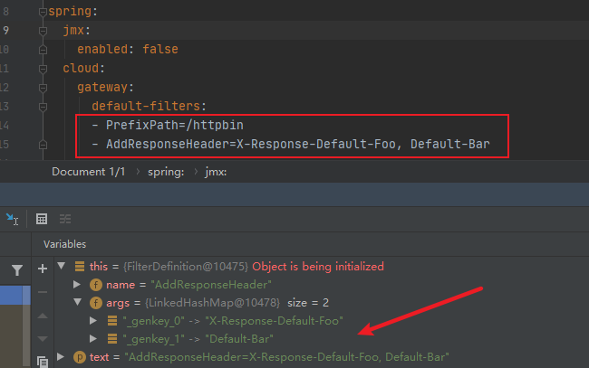
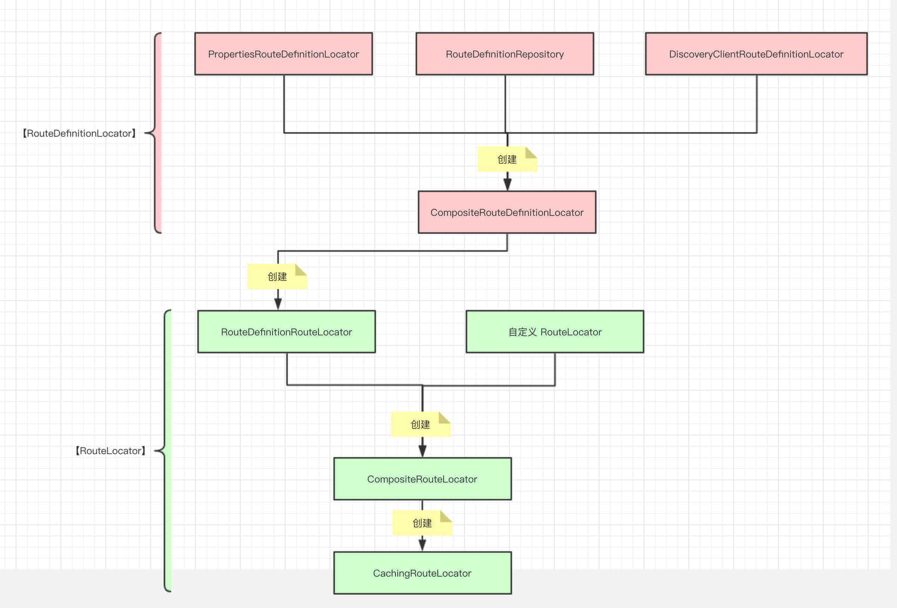
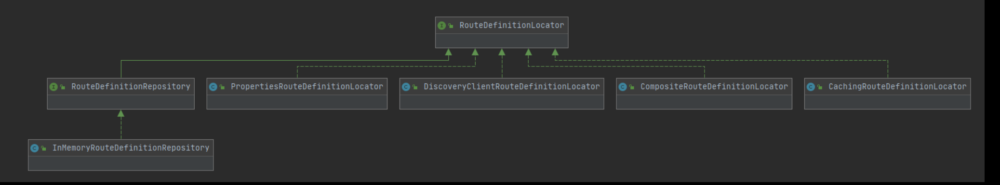
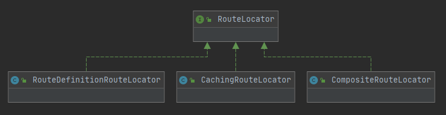
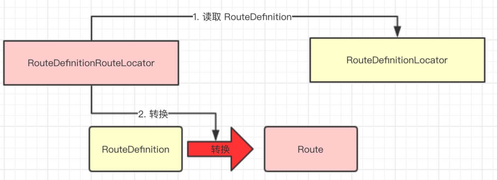

## 概述

参考文档：

http://c.biancheng.net/springcloud/gateway.html

https://github.com/YunaiV/Blog

> Base

Spring Cloud Gateway 是基于 `Spring 5.0`、`Spring Boot 2.0` 、`project reactor`和`WebFlux`框架实现的，而 WebFlux 框架底层则使用了高性能的 Reactor 模式通信框架 Netty。

-  **project reactor**，遵循 Reactive Streams Specification，使用非阻塞编程模型。

- **webflux**，基于 spring 5.x 和 `reactor-netty` 构建，不依赖于 Servlet 容器，但是可以在支持 Servlet 3.1 Non-Blocking IO API 的容器上运行。

### 工作流程


1. 客户端将请求发送到Gateway上；
2. Gateway通过Gateway Handler Mapping找到请求相匹配的路由，将其发送到对应的Gateway Web Handler；
3. Gateway Web Handler通过指定的过滤器链（Filter Chain），将请求转发到实际的服务节点中，执行业务逻辑返回响应结果；
4. 过滤器之间用虚线分开是因为过滤器可能会在转发请求之前（pre）或之后（post）执行业务逻辑；
5. 过滤器（Filter）可以在请求被转发到服务端前，对请求进行拦截和修改，例如：参数校验，权限校验，流量监控，日志输出以及协议转换等；
6. 过滤器可以在响应返回客户端之前，对响应进行拦截和再处理，例如：修改响应内容，修改响应头，日志输出，流量监控等；
7. 响应原路返回给客户端。

> 组件交互


### Predicate 断言

Spring Cloud Gateway 通过 ==Predicate 断言来实现 Route 路由的匹配规则==。简单点说，Predicate 是路由转发的判断条件，请求只有==满足了 Predicate 的条件，才会被转发到指定的服务上==进行处理。


> 注意点

- Route 路由与 Predicate 断言的对应关系为“一对多”，一个路由可以包含多个不同断言。
- 一个请求想要转发到指定的路由上，就必须同时匹配路由上的所有断言。
- 当一个请求同时满足多个路由的断言条件时，请求只会被首个成功匹配的路由转发。

### Filter 过滤器

> 按类型划分

- Pre 类型  

  这种过滤器在**请求被转发到微服务之前**可以对请求进行拦截和修改，例如参数校验、权限校验、流量监控、日志输出以及协议转换等操作。

- Post 类型 

  这种过滤器**在微服务对请求做出响应后**可以对响应进行拦截和再处理，例如修改响应内容或响应头、日志输出、流量监控等。

> 按作用范围划分

- GatewayFilter：应用在单个路由或者一组路由上的过滤器。
- GlobalFilter：应用在所有的路由上的过滤器。

## 启动

spring-cloud-gateway-server配置文件spring.factories加载配置类：

```properties
# Auto Configure
org.springframework.boot.autoconfigure.EnableAutoConfiguration=\
org.springframework.cloud.gateway.config.GatewayClassPathWarningAutoConfiguration,\
org.springframework.cloud.gateway.config.GatewayAutoConfiguration,\
org.springframework.cloud.gateway.config.GatewayHystrixCircuitBreakerAutoConfiguration,\
org.springframework.cloud.gateway.config.GatewayResilience4JCircuitBreakerAutoConfiguration,\
org.springframework.cloud.gateway.config.GatewayLoadBalancerClientAutoConfiguration,\
org.springframework.cloud.gateway.config.GatewayNoLoadBalancerClientAutoConfiguration,\
org.springframework.cloud.gateway.config.GatewayMetricsAutoConfiguration,\
org.springframework.cloud.gateway.config.GatewayRedisAutoConfiguration,\
org.springframework.cloud.gateway.discovery.GatewayDiscoveryClientAutoConfiguration,\
org.springframework.cloud.gateway.config.SimpleUrlHandlerMappingGlobalCorsAutoConfiguration,\
org.springframework.cloud.gateway.config.GatewayReactiveLoadBalancerClientAutoConfiguration

org.springframework.boot.env.EnvironmentPostProcessor=\
org.springframework.cloud.gateway.config.GatewayEnvironmentPostProcessor

# Failure Analyzers
org.springframework.boot.diagnostics.FailureAnalyzer=\
org.springframework.cloud.gateway.support.MvcFoundOnClasspathFailureAnalyzer
```

### GatewayAutoConfiguration

网关开启配置：`spring.cloud.gateway.enabled`，默认开启。GatewayAutoConfiguration用来加载响应的Bean组件。

```java
@Configuration(proxyBeanMethods = false)
// 默认开启网关
@ConditionalOnProperty(name = "spring.cloud.gateway.enabled", matchIfMissing = true)
@EnableConfigurationProperties
// GatewayAutoConfiguration之后加载
@AutoConfigureBefore({ HttpHandlerAutoConfiguration.class, WebFluxAutoConfiguration.class })
// GatewayAutoConfiguration之前加载
@AutoConfigureAfter({ GatewayLoadBalancerClientAutoConfiguration.class, GatewayClassPathWarningAutoConfiguration.class })
@ConditionalOnClass(DispatcherHandler.class)
public class GatewayAutoConfiguration {
    
    // Netty实现的Client(封装了连接池ConnectionProvider)
    @Bean
    @ConditionalOnMissingBean
    public HttpClient gatewayHttpClient(HttpClientProperties properties, List<HttpClientCustomizer> customizers) {}

    @Bean
    @ConditionalOnEnabledGlobalFilter
    public NettyRoutingFilter routingFilter(HttpClient httpClient, ObjectProvider<List<HttpHeadersFilter>> headersFilters, HttpClientProperties properties) {
        return new NettyRoutingFilter(httpClient, headersFilters, properties);
    }

    @Bean
    @ConditionalOnEnabledGlobalFilter
    public NettyWriteResponseFilter nettyWriteResponseFilter(GatewayProperties properties) {
        return new NettyWriteResponseFilter(properties.getStreamingMediaTypes());
    }

    @Bean
    public ReactorNettyWebSocketClient reactorNettyWebSocketClient(HttpClientProperties properties, HttpClient httpClient) {
        ReactorNettyWebSocketClient webSocketClient = new ReactorNettyWebSocketClient(httpClient);
        if (properties.getWebsocket().getMaxFramePayloadLength() != null) {
            webSocketClient.setMaxFramePayloadLength(properties.getWebsocket().getMaxFramePayloadLength());
        }
        webSocketClient.setHandlePing(properties.getWebsocket().isProxyPing());
        return webSocketClient;
    }
    
    // ======================================= 分割线 ======================================= //
    
    // 全局过滤器GlobalFilter
      @Bean
    @ConditionalOnEnabledGlobalFilter
    public RouteToRequestUrlFilter routeToRequestUrlFilter() {
      return new RouteToRequestUrlFilter();
    }

      @Bean
    @ConditionalOnEnabledGlobalFilter
    public ForwardRoutingFilter forwardRoutingFilter(
        ObjectProvider<DispatcherHandler> dispatcherHandler) {
      return new ForwardRoutingFilter(dispatcherHandler);
    }

    // gateway Filter
    @Bean
    public FilteringWebHandler filteringWebHandler(List<GlobalFilter> globalFilters) {
      return new FilteringWebHandler(globalFilters);
    }

    // 初始化gateway propeties
    @Bean
    public GatewayProperties gatewayProperties() {
      return new GatewayProperties();
    }

    // ======================================= 分割线 ======================================= //

    // 初始化GatewayFilterFactory, 有很多个喔
    @Bean
    @ConditionalOnEnabledFilter
    public PrefixPathGatewayFilterFactory prefixPathGatewayFilterFactory() {
      return new PrefixPathGatewayFilterFactory();
    }

    // Predicate Factory beans
    // 初始化PredicateFactory, 有很多个喔
    @Bean
    @ConditionalOnEnabledPredicate
    public AfterRoutePredicateFactory afterRoutePredicateFactory() {
      return new AfterRoutePredicateFactory();
    }
    
  	// ======================================= 分割线 ======================================= //
  
  	// 初始化RouteDefinitionLocator
  	@Bean
    @ConditionalOnMissingBean
    public PropertiesRouteDefinitionLocator propertiesRouteDefinitionLocator(GatewayProperties properties) {
      return new PropertiesRouteDefinitionLocator(properties);
    }

    @Bean
    @ConditionalOnMissingBean(RouteDefinitionRepository.class)
    public InMemoryRouteDefinitionRepository inMemoryRouteDefinitionRepository() {
      return new InMemoryRouteDefinitionRepository();
    }

    @Bean
    @Primary // 优先注入
    public RouteDefinitionLocator routeDefinitionLocator(List<RouteDefinitionLocator> routeDefinitionLocators) {
      return new CompositeRouteDefinitionLocator(Flux.fromIterable(routeDefinitionLocators));
    }
  
  	// ======================================= 分割线 ======================================= //

  	// 初始化RouteLocator
    @Bean
    public RouteLocator routeDefinitionRouteLocator(GatewayProperties properties,
                                                    List<GatewayFilterFactory> gatewayFilters,
                                                    List<RoutePredicateFactory> predicates,
                                                    RouteDefinitionLocator routeDefinitionLocator,
                                                    ConfigurationService configurationService) {
      return new RouteDefinitionRouteLocator(routeDefinitionLocator, predicates, gatewayFilters, properties, configurationService);
    }

    @Bean
    @Primary
    @ConditionalOnMissingBean(name = "cachedCompositeRouteLocator")
    // TODO: property to disable composite?
    public RouteLocator cachedCompositeRouteLocator(List<RouteLocator> routeLocators) {
      return new CachingRouteLocator(new CompositeRouteLocator(Flux.fromIterable(routeLocators)));
    }
  
  	// 初始化RoutePredicateHandlerMapping，用于查找匹配到Route，并进行处理
    @Bean
    public RoutePredicateHandlerMapping routePredicateHandlerMapping(
      FilteringWebHandler webHandler, RouteLocator routeLocator,
      GlobalCorsProperties globalCorsProperties, Environment environment) {
      return new RoutePredicateHandlerMapping(webHandler, routeLocator,
                                              globalCorsProperties, environment);
    }

    // ======================================= 分割线 ======================================= //
    
    @Configuration(proxyBeanMethods = false)
    @ConditionalOnClass({ HystrixObservableCommand.class, RxReactiveStreams.class })
    protected static class HystrixConfiguration {

        @Bean
        @ConditionalOnEnabledFilter
        public HystrixGatewayFilterFactory hystrixGatewayFilterFactory(
            ObjectProvider<DispatcherHandler> dispatcherHandler) {
            return new HystrixGatewayFilterFactory(dispatcherHandler);
        }

        @Bean
        @ConditionalOnMissingBean(FallbackHeadersGatewayFilterFactory.class)
        @ConditionalOnEnabledFilter
        public FallbackHeadersGatewayFilterFactory fallbackHeadersGatewayFilterFactory() {
            return new FallbackHeadersGatewayFilterFactory();
        }

    }
}
```

初始化GatewayControllerEndpoint，提供管理网关的HTTP API。

```java
@Configuration(proxyBeanMethods = false)
@ConditionalOnClass(Health.class)
protected static class GatewayActuatorConfiguration {

   @Bean
   @ConditionalOnProperty(name = "spring.cloud.gateway.actuator.verbose.enabled",
         matchIfMissing = true)
   @ConditionalOnAvailableEndpoint
   public GatewayControllerEndpoint gatewayControllerEndpoint(
         List<GlobalFilter> globalFilters,
         List<GatewayFilterFactory> gatewayFilters,
         List<RoutePredicateFactory> routePredicates,
         RouteDefinitionWriter routeDefinitionWriter, RouteLocator routeLocator,
         RouteDefinitionLocator routeDefinitionLocator) {
      return new GatewayControllerEndpoint(globalFilters, gatewayFilters,
            routePredicates, routeDefinitionWriter, routeLocator,
            routeDefinitionLocator);
   }

   @Bean
   @Conditional(OnVerboseDisabledCondition.class)
   @ConditionalOnAvailableEndpoint
   public GatewayLegacyControllerEndpoint gatewayLegacyControllerEndpoint(
         RouteDefinitionLocator routeDefinitionLocator,
         List<GlobalFilter> globalFilters,
         List<GatewayFilterFactory> gatewayFilters,
         List<RoutePredicateFactory> routePredicates,
         RouteDefinitionWriter routeDefinitionWriter, RouteLocator routeLocator) {
      return new GatewayLegacyControllerEndpoint(routeDefinitionLocator,
            globalFilters, gatewayFilters, routePredicates, routeDefinitionWriter,
            routeLocator);
   }

}
```

### GatewayClassPathWarningAutoConfiguration

GatewayClassPathWarningAutoConfiguration在GatewayAutoConfiguration之前加载。作用主要是：检查依赖，检查项目是否正确导入 `spring-boot-starter-webflux` 依赖，而不是错误导入 `spring-boot-starter-web` 依赖。

```java
@Configuration(proxyBeanMethods = false)
@AutoConfigureBefore(GatewayAutoConfiguration.class)
@ConditionalOnProperty(name = "spring.cloud.gateway.enabled", matchIfMissing = true)
public class GatewayClassPathWarningAutoConfiguration {

   // 引入了spring-boot-starter-web依赖，报错
   @Configuration(proxyBeanMethods = false)
   @ConditionalOnClass(name = "org.springframework.web.servlet.DispatcherServlet")
   @ConditionalOnWebApplication(type = ConditionalOnWebApplication.Type.SERVLET)
   protected static class SpringMvcFoundOnClasspathConfiguration {
      public SpringMvcFoundOnClasspathConfiguration() {
         throw new MvcFoundOnClasspathException();
      }
   }

   @Configuration(proxyBeanMethods = false)
   @ConditionalOnMissingClass("org.springframework.web.reactive.DispatcherHandler")
   protected static class WebfluxMissingFromClasspathConfiguration {
      public WebfluxMissingFromClasspathConfiguration() {}
   }

}
```

## 组件

### Route

具体路由信息载体。

```java
public class Route implements Ordered {
	// 标识符：区别于其他Route
  private final String id;
	// 路由指向目的地uri，即客户端请求最终被转发的目的地
  private final URI uri;
	// 用于多个Route之间的排序，数值越小排序越靠前，匹配优先级越高
  private final int order;
	// 断言，匹配该 Route 的前置条件，即满足相应的条件才会被路由到目的地 uri。
  private final AsyncPredicate<ServerWebExchange> predicate;
	// 适用路由的过滤器，用于处理切面逻辑，如路由转发前修改请求头等
  private final List<GatewayFilter> gatewayFilters;
	// 元数据
  private final Map<String, Object> metadata;
}
```

#### 构建Route

##### 配置文件

```yaml
spring:
  cloud:
    gateway: # ①
      routes: # ②
      - id: cookie_route # ③
        uri: http://example.org # ④
        predicates: # ⑤
        - Cookie=chocolate, ch.p # ⑥
        filters: # ⑦ 
        - AddRequestHeader=X-Request-Foo, Bar # ⑧
```

1. "spring.cloud.gateway" 为固定前缀；
2. 定义路由信息列表，即可定义多个路由；
3. 声明了一个 id 为 "cookie_route" 的路由；
4. 定义了路由的目的地 uri，即请求转发的目的地；
5. 声明 predicates，即请求满足相应的条件才能匹配成功；
6. 定义了一个 Predicate，当名称为 `chocolate` 的 Cookie  的值匹配`ch.p`时 Predicate 才能够匹配，它由 CookieRoutePredicateFactory 来生产；
7. 声明 filters，即路由转发前后处理的过滤器；
8. 定义了一个 Filter，所有的请求转发至下游服务时会添加请求头 `X-Request-Foo:Bar` ，由AddRequestHeaderGatewayFilterFactory 来生产。


##### 编程方式

```java
// static imports from GatewayFilters and RoutePredicates
@Bean
public RouteLocator customRouteLocator(RouteLocatorBuilder builder) { // ①
  return builder.routes() // ②
    .route(r -> r.host("**.abc.org").and().path("/image/png") // ③
           .filters(f ->
                    f.addResponseHeader("X-TestHeader", "foobar")) // ④
           .uri("http://httpbin.org:80") // ⑤
          )
    .build();
}
```

1. RouteLocatorBuilder bean 在 spring-cloud-starter-gateway 模块自动装配类中已经声明，可直接使用。RouteLocator 封装了对 Route 获取的定义，可简单理解成工厂模；
2. RouteLocatorBuilder 可以构建多个路由信息；
3. 指定了 Predicates，这里包含两个：
   1. 请求头`Host`需要匹配`**.abc.org`，通过 HostRoutePredicateFactory 产生。
   2. 请求路径需要匹配`/image/png`，通过 PathRoutePredicateFactory 产生。
4. 指定了一个 Filter，下游服务响应后添加响应头`X-TestHeader:foobar`，通过AddResponseHeaderGatewayFilterFactory 产生；
5. 指定路由转发的目的地 uri。

#### 构建原理

##### GatewayProperties

加载配置yml，绑定GatewayProperties。

```java
@ConfigurationProperties(GatewayProperties.PREFIX)
@Validated
public class GatewayProperties {
    // 绑定前缀spring.cloud.gateway
    public static final String PREFIX = "spring.cloud.gateway";
	// Route定义
    private List<RouteDefinition> routes = new ArrayList<>();
	// 默认Filter
    private List<FilterDefinition> defaultFilters = new ArrayList<>();
}
```

##### RouteDefinition

对`Route`信息进行定义，最终会被`RouteLocator`解析成`Route`。

```java
public class RouteDefinition {
	// 定义 Route 的 id，默认使用 UUID
    private String id;
    // 定义 Predicate
    private List<PredicateDefinition> predicates = new ArrayList<>();
	// 定义 Filter
    private List<FilterDefinition> filters = new ArrayList<>();
	// 定义目的地 URI
    private URI uri;
	// 定义元数据
    private Map<String, Object> metadata = new HashMap<>();
	// 定义 Route 的顺序
    private int order = 0;
}
```

##### FilterDefinition

遵循组件名前缀 + `Definition` 后缀的命名规范，用于定义 Filter

```java
public class FilterDefinition {
    // 定义了 Filter 的名称，符合特定的命名规范，为对应的工厂名前缀
    private String name;
    // 一个键值对参数用于构造 Filter 对象
    private Map<String, String> args = new LinkedHashMap<>();
}
```

配置文件配置的filters，被Spring解析后绑定到一个FilterDefinition。

```yaml
spring:
  cloud:
    gateway:
      routes:
      - id: add_request_header_route
        uri: http://example.org
        filters:
        - AddRequestHeader=X-Request-Foo, Bar # ①
```

- AddRequestHeader：对应 FilterDefinition 中的 `name` 属性。
- X-Request-Foo, Bar：会被解析成 FilterDefinition 中的 Map 类型属性 `args`。此处会被解析成两组键值对，以英文逗号将`=`后面的字符串分隔成数组，`key`是固定字符串 `_genkey_` + 数组元素下标，`value`为数组元素自身。



```java
// FilterDefinition 构造函数
public FilterDefinition(String text) {
    int eqIdx = text.indexOf("=");
    if (eqIdx <= 0) {
        setName(text);
        return;
    }
    setName(text.substring(0, eqIdx));
    String[] args = tokenizeToStringArray(text.substring(eqIdx+1), ",");
    for (int i=0; i < args.length; i++) {
        this.args.put(NameUtils.generateName(i), args[i]); // ①
    }
}

// ① 使用到的工具类 NameUtils 源码
public class NameUtils {
    public static final String GENERATED_NAME_PREFIX = "_genkey_";
    public static String generateName(int i) {
        return GENERATED_NAME_PREFIX + i;
    }
}
```

##### PredicateDefinition

同样遵循组件名前缀 + `Definition` 后缀的命名规范，用于定义 Predicate。

```java
public class PredicateDefinition {
   // 定义了 Predicate 的名称，它们要符固定的命名规范，为对应的工厂名称前缀
   private String name;
	// 一个 Map 类型的参数，构造 Predicate 使用到的键值对参数，格式与FilterDefinition相似
   private Map<String, String> args = new LinkedHashMap<>();
}
```

##### RoutePredicateFactory

RoutePredicateFactory 是所有 predicate factory 的顶级接口，职责就是生产 Predicate。

创建一个用于配置用途的对象（config），以其作为参数应用到 `apply`方法上来生产一个 Predicate 对象，再将 Predicate 对象包装成 AsyncPredicate。

```java
import static org.springframework.cloud.gateway.support.ServerWebExchangeUtils.toAsyncPredicate;

@FunctionalInterface // 声明它是一个函数接口
public interface RoutePredicateFactory<C> extends ShortcutConfigurable, Configurable<C> { //  扩展了 Configurable 接口，从命名上可以推断 Predicate 工厂是支持配置的
	// 核心方法，即函数接口的唯一抽象方法，用于生产 Predicate，接收一个范型参数 config
    Predicate<ServerWebExchange> apply(C config);
	// 对参数 config 应用工厂方法，并将返回结果 Predicate 包装成 AsyncPredicate。包装成 AsyncPredicate 是为了使用非阻塞模型
    default AsyncPredicate<ServerWebExchange> applyAsync(C config) {
        return toAsyncPredicate(apply(config));
    }
}

// RoutePredicateFactory 扩展了 Configurable
public interface Configurable<C> {
    Class<C> getConfigClass();  // 获取配置类的类型，支持范型，具体的 config 类型由子类指定
    C newConfig(); // 创建一个 config 实例，由具体的实现类来完成
}
```

###### AfterRoutePredicateFactory

`AfterRoutePredicateFactory`是`RoutePredicateFactory`的之类，下面举例说明如何由配置文件生成`Predicate`对象的过程。

- 配置文件

```yaml
spring:
  cloud:
    gateway:
      routes:
      - id: after_route
        uri: http://example.org
        predicates:
        - After=2017-01-20T17:42:47.789-07:00[America/Denver] 
```

- 解析绑定`PredicateDefinition`

```java
PredicateDefinition {
    name='After',
    args={_genkey_0=2017-01-20T17:42:47.789-07:00[America/Denver]}
}
```

- `Predicate`对象生成

```java
public class AfterRoutePredicateFactory extends AbstractRoutePredicateFactory<AfterRoutePredicateFactory.Config> {

    /**
    * DateTime key.
    */
    public static final String DATETIME_KEY = "datetime";

    public AfterRoutePredicateFactory() {
        super(Config.class);
    }

    @Override
    public List<String> shortcutFieldOrder() {
        return Collections.singletonList(DATETIME_KEY);
    }

    @Override
    public Predicate<ServerWebExchange> apply(Config config) {
        return new GatewayPredicate() {
            @Override
            public boolean test(ServerWebExchange serverWebExchange) {
                final ZonedDateTime now = ZonedDateTime.now();
                // 执行配置文件时间的判断：2017-01-20T17:42:47.789-07:00[America/Denver] 
                return now.isAfter(config.getDatetime());
            }

            @Override
            public String toString() {
                return String.format("After: %s", config.getDatetime());
            }
        };
    }

    public static class Config {
        // 保存配置文件的时间：2017-01-20T17:42:47.789-07:00[America/Denver] 
        @NotNull
        private ZonedDateTime datetime;

        public ZonedDateTime getDatetime() {
            return datetime;
        }

        public void setDatetime(ZonedDateTime datetime) {
            this.datetime = datetime;
        }

    }

}
```

**引申疑问点：**：

1. PredicateDefinition 对象又是如何转换成 AfterRoutePredicateFactory.Config 对象的？
2. PredicateDefinition 又是如何生成的呢？

对于第1点，主要涉及 RouteLocator 组件。

##### GatewayFilterFactory

GatewayFilterFactory 职责就是生产 GatewayFilter。

```java
@FunctionalInterface
public interface GatewayFilterFactory<C> extends ShortcutConfigurable, Configurable<C> { // 同样继承了 ShortcutConfigurable 和 Configurable 接口，支持配置。
    String NAME_KEY = "name";
    String VALUE_KEY = "value";

    GatewayFilter apply(C config); // 核心方法，用于生产 GatewayFilter，接收一个范型参数 config 
}
```

##### RouteLocator&RouteDefinitionLocator

```java
// Route的定位器，获取Route
public interface RouteLocator {
	Flux<Route> getRoutes();
}

// RouteDefinition的定位器，获取RouteDefinition
public interface RouteDefinitionLocator {
	Flux<RouteDefinition> getRouteDefinitions();
}
```

##### RouteDefinitionRouteLocator

`RouteDefinitionRouteLocator`为`RouteLocator`主要实现类，用于将`RouteDefinition`转换成`Route`。

- 构造器

> 注意：
>
> 1、routeDefinitionLocator中的RouteDefinition是定义的routes；
>
> 2、GatewayProperties 类中的RouteDefinition，是定义的 default_filters，这会应用到每一个 Route 上.

```java
public class RouteDefinitionRouteLocator implements RouteLocator, BeanFactoryAware, ApplicationEventPublisherAware {
	// 一个 RouteDefinitionLocator 对象
    private final RouteDefinitionLocator routeDefinitionLocator;

    private final ConfigurationService configurationService;
	// Predicate 工厂列表，会被映射成 key 为 name, value 为 factory 的 Map。对应PredicateDefinition 中定义的 name。
    private final Map<String, RoutePredicateFactory> predicates = new LinkedHashMap<>();
	// Gateway Filter 工厂列表，同样会被映射成 key 为 name, value 为 factory 的 Map。对应FilterDefinition中定义的name。
    private final Map<String, GatewayFilterFactory> gatewayFilterFactories = new HashMap<>();
	// 外部化配置类
    private final GatewayProperties gatewayProperties;

    public RouteDefinitionRouteLocator(RouteDefinitionLocator routeDefinitionLocator,
                                       List<RoutePredicateFactory> predicates,
                                       List<GatewayFilterFactory> gatewayFilterFactories,
                                       GatewayProperties gatewayProperties,
                                       ConfigurationService configurationService) {
        this.routeDefinitionLocator = routeDefinitionLocator;
        this.configurationService = configurationService;
        initFactories(predicates);
        gatewayFilterFactories.forEach(
            factory -> this.gatewayFilterFactories.put(factory.name(), factory));
        this.gatewayProperties = gatewayProperties;
    }
}
```

###### getRoutes

```java
@Override
public Flux<Route> getRoutes() {
    // 调用 convertToRoute 方法将 RouteDefinition 转换成 Route
    Flux<Route> routes = this.routeDefinitionLocator.getRouteDefinitions()
        .map(this::convertToRoute);

    if (!gatewayProperties.isFailOnRouteDefinitionError()) {
        // instead of letting error bubble up, continue
        routes = routes.onErrorContinue((error, obj) -> {
            if (logger.isWarnEnabled()) {
                logger.warn("RouteDefinition id " + ((RouteDefinition) obj).getId()
                            + " will be ignored. Definition has invalid configs, "
                            + error.getMessage());
            }
        });
    }

    return routes.map(route -> {
        if (logger.isDebugEnabled()) {
            logger.debug("RouteDefinition matched: " + route.getId());
        }
        return route;
    });
}

// RouteDefinition转成Route
private Route convertToRoute(RouteDefinition routeDefinition) {
    //  将 PredicateDefinition 转换成 AsyncPredicate
    AsyncPredicate<ServerWebExchange> predicate = combinePredicates(routeDefinition);
    // 将 FilterDefinition 转换成 GatewayFilter
    List<GatewayFilter> gatewayFilters = getFilters(routeDefinition);
	// 生成route
    return Route.async(routeDefinition).asyncPredicate(predicate)
        .replaceFilters(gatewayFilters).build();
}

```

###### combinePredicates

从`RouteDefinition`中获取`PredicateDefinition` ，并转换成 `AsyncPredicate`。

```java
private AsyncPredicate<ServerWebExchange> combinePredicates(RouteDefinition routeDefinition) {
    List<PredicateDefinition> predicates = routeDefinition.getPredicates();
    if (predicates == null || predicates.isEmpty()) {
        // this is a very rare case, but possible, just match all
        return AsyncPredicate.from(exchange -> true);
    }
    
    // 调用 lookup 方法，将列表中第一个 PredicateDefinition 转换成 AsyncPredicate
    AsyncPredicate<ServerWebExchange> predicate = lookup(routeDefinition, predicates.get(0));

    for (PredicateDefinition andPredicate : predicates.subList(1, predicates.size())) {
        // 循环调用，将列表中每一个 PredicateDefinition 都转换成 AsyncPredicate
        AsyncPredicate<ServerWebExchange> found = lookup(routeDefinition, andPredicate);
        // 应用and操作，将所有的 AsyncPredicate 组合成一个 AsyncPredicate 对象
        predicate = predicate.and(found);
    }

    return predicate;
}
```

- lookup

```java
private AsyncPredicate<ServerWebExchange> lookup(RouteDefinition route, PredicateDefinition predicate) {
    // 根据 predicate 名称获取对应的 predicate factory
    RoutePredicateFactory<Object> factory = this.predicates.get(predicate.getName());
    if (factory == null) {
        throw new IllegalArgumentException("Unable to find RoutePredicateFactory with name " + predicate.getName());
    }
    if (logger.isDebugEnabled()) {
        logger.debug("RouteDefinition " + route.getId() + " applying " + predicate.getArgs() + " to " + predicate.getName());
    }

    // @formatter:off
    // PredicateDefinition的参数绑定到 config 对象上
    Object config = this.configurationService.with(factory)
        .name(predicate.getName())
        .properties(predicate.getArgs()) // 获取 PredicateDefinition 中的 Map 类型参数，key 是固定字符串_genkey_ + 数字拼接而成
        .eventFunction((bound, properties) -> new PredicateArgsEvent(
            RouteDefinitionRouteLocator.this, route.getId(), properties))
        .bind();
    // @formatter:on
    //  将 cofing 作参数代入，调用 factory 的 applyAsync 方法创建 AsyncPredicate 对象
    return factory.applyAsync(config);
}
```

###### getFilters

从`RouteDefinition`中获取`Filters` 和从`gatewayProperties`获取`DefaultFilters`，并将其转换成 `GatewayFilter`。

`loadGatewayFilters`为生产filter方法，与生成predicate方法相似。

```java
private List<GatewayFilter> getFilters(RouteDefinition routeDefinition) {
   List<GatewayFilter> filters = new ArrayList<>();

   // TODO: support option to apply defaults after route specific filters?
   // 处理 GatewayProperties 中定义的默认的 FilterDefinition，转换成 GatewayFilter。
   if (!this.gatewayProperties.getDefaultFilters().isEmpty()) {
      filters.addAll(loadGatewayFilters(routeDefinition.getId(),
            new ArrayList<>(this.gatewayProperties.getDefaultFilters())));
   }
	// 将 RouteDefinition 中定义的 FilterDefinition 转换成 GatewayFilter
   if (!routeDefinition.getFilters().isEmpty()) {
      filters.addAll(loadGatewayFilters(routeDefinition.getId(),
            new ArrayList<>(routeDefinition.getFilters())));
   }
	// 对 GatewayFilter 进行排序，排序的详细逻辑请查阅 spring 中的 Ordered 接口
   AnnotationAwareOrderComparator.sort(filters);
   return filters;
}
```


### AsyncPredicate

Predicate 即 Route 中所定义的部分，用于条件匹配。

```java
public interface AsyncPredicate<T> extends Function<T, Publisher<Boolean>> {
	// 与操作，同时满足两个predicate
  default AsyncPredicate<T> and(AsyncPredicate<? super T> other) {
    return new AndAsyncPredicate<>(this, other);
  }
	// 取反操作，对predicate匹配结果取反
  default AsyncPredicate<T> negate() {
    return new NegateAsyncPredicate<>(this);
  }
	// 或操作，即两个predicate满足其中一个即可
  default AsyncPredicate<T> not(AsyncPredicate<? super T> other) {
    return new NegateAsyncPredicate<>(other);
  }
	// 非操作，即满足predicate，但与另外的predicate匹配结果相反
  default AsyncPredicate<T> or(AsyncPredicate<? super T> other) {
    return new OrAsyncPredicate<>(this, other);
  }
}
```

### GatewayFilter

Filter 最终是通过 filter chain 来形成链式调用的，每个 filter 处理完 pre filter 逻辑后，调用方法`chain.filter(exchange)`，将 exchange 委派给  filterChain，filterChain 再委派给下一下 filter。

```java
public interface GatewayFilter extends ShortcutConfigurable {

   String NAME_KEY = "name";
   String VALUE_KEY = "value";

   /**
    * Process the Web request and (optionally) delegate to the next {@code WebFilter}
    * through the given {@link GatewayFilterChain}.
    * @param exchange the current server exchange
    * @param chain provides a way to delegate to the next filter
    * @return {@code Mono<Void>} to indicate when request processing is complete
    */
   Mono<Void> filter(ServerWebExchange exchange, GatewayFilterChain chain);

}
```

### GatewayFilterChain

- GatewayFilterChain接口

```java
public interface GatewayFilterChain {

   /**
    * Delegate to the next {@code WebFilter} in the chain.
    * @param exchange the current server exchange
    * @return {@code Mono<Void>} to indicate when request handling is complete
    */
   Mono<Void> filter(ServerWebExchange exchange);

}
```

- GatewayFilterChain实现方法

```java
private static class DefaultGatewayFilterChain implements GatewayFilterChain {
  private final int index;
  private final List<GatewayFilter> filters;

  DefaultGatewayFilterChain(List<GatewayFilter> filters) {
    this.filters = filters;
    this.index = 0;
  }

  private DefaultGatewayFilterChain(DefaultGatewayFilterChain parent, int index) {
    this.filters = parent.getFilters();
    this.index = index;
  }

  public List<GatewayFilter> getFilters() {
    return filters;
  }

	// filters在容器启动时注入
  // 每次调用filter方法之后index + 1，获取下一个filter进行过滤
  @Override
  public Mono<Void> filter(ServerWebExchange exchange) {
    return Mono.defer(() -> {
      if (this.index < filters.size()) {
        GatewayFilter filter = filters.get(this.index);
        DefaultGatewayFilterChain chain = new DefaultGatewayFilterChain(this,
                                                                        this.index + 1);
        return filter.filter(exchange, chain);
      }
      else {
        return Mono.empty(); // complete
      }
    });
  }
}
```

## 路由



### RouteDefinitionLocator

负责读取路由配置，转换成RouteDefintion

```java
public interface RouteDefinitionLocator {
   Flux<RouteDefinition> getRouteDefinitions();
}
```

- 实现类

`PropertiesRouteDefinitionLocator`：从配置文件中读取，如yml、properties等；

`RouteDefinitionRepository`：从存储器中读取，如内存、Redis、MySQL等；

`DiscoveryClientRouteDefinitionLocator`：从注册中心读取；

`CompositeRouteDefinitionLocator`：组合多种RouteDefinitionLocator实现，为RouteDefinitionLocator提供统一的入口。



#### RouteDefinition

- 构造器

```java
// 可以通过 text 来创建RouteDefinition
// text格式：${id}=${uri},${predicates[0]},${predicates[1]}...${predicates[n]}
// 	   例如: route001=http://127.0.0.1,Host=**.addrequestparameter.org,Path=/get
public RouteDefinition(String text) {
   int eqIdx = text.indexOf('=');
   if (eqIdx <= 0) {
      throw new ValidationException("Unable to parse RouteDefinition text '" + text
            + "'" + ", must be of the form name=value");
   }

   setId(text.substring(0, eqIdx));

   String[] args = tokenizeToStringArray(text.substring(eqIdx + 1), ",");

   setUri(URI.create(args[0]));

   for (int i = 1; i < args.length; i++) {
      this.predicates.add(new PredicateDefinition(args[i]));
   }
}
```

#### PredicateDefinition

- 构造器

```java
// 可以通过 text 来创建PredicateDefinition
// text格式：${name}=${args[0]},${args[1]}...${args[n]}
// 	   例如:  Host=iocoder.cn
public PredicateDefinition(String text) {
   int eqIdx = text.indexOf('=');
   if (eqIdx <= 0) {
      throw new ValidationException("Unable to parse PredicateDefinition text '"
            + text + "'" + ", must be of the form name=value");
   }
   setName(text.substring(0, eqIdx));

   String[] args = tokenizeToStringArray(text.substring(eqIdx + 1), ",");

   for (int i = 0; i < args.length; i++) {
      this.args.put(NameUtils.generateName(i), args[i]);
   }
}
```

#### FilterDefinition

- 构造器

```java
// 可以通过 text 来创建FilterDefinition
// text 格式 ${name}=${args[0]},${args[1]}...${args[n]}
// 	   例如: AddRequestParameter=foo, bar
public FilterDefinition(String text) {
   int eqIdx = text.indexOf('=');
   if (eqIdx <= 0) {
      setName(text);
      return;
   }
   setName(text.substring(0, eqIdx));

   String[] args = tokenizeToStringArray(text.substring(eqIdx + 1), ",");

   for (int i = 0; i < args.length; i++) {
      this.args.put(NameUtils.generateName(i), args[i]);
   }
}
```

#### CompositeRouteDefinitionLocator

`org.springframework.cloud.gateway.route.CompositeRouteDefinitionLocator` ，组合多种RouteDefinitionLocator 的实现，为 RouteDefinitionRouteLocator 提供统一入口。

`getRouteDefinitions`会提供统一方法，将组合的 `delegates` 的路由定义全部返回。

```java
public class CompositeRouteDefinitionLocator implements RouteDefinitionLocator {
    // RouteDefinitionLocator数组
    private final Flux<RouteDefinitionLocator> delegates;
    private final IdGenerator idGenerator;
	// 注入RouteDefinitionLocator
    public CompositeRouteDefinitionLocator(Flux<RouteDefinitionLocator> delegates) {
        this(delegates, new AlternativeJdkIdGenerator());
    }

    public CompositeRouteDefinitionLocator(Flux<RouteDefinitionLocator> delegates,
                                           IdGenerator idGenerator) {
        this.delegates = delegates;
        this.idGenerator = idGenerator;
    }

    // 汇聚所有的RouteDefinitionLocator，返回RouteDefinition
    @Override
    public Flux<RouteDefinition> getRouteDefinitions() {
        return this.delegates
            .flatMapSequential(RouteDefinitionLocator::getRouteDefinitions)
            .flatMap(routeDefinition -> {
                if (routeDefinition.getId() == null) {
                    return randomId().map(id -> {
                        routeDefinition.setId(id);
                        if (log.isDebugEnabled()) {
                            log.debug(
                                "Id set on route definition: " + routeDefinition);
                        }
                        return routeDefinition;
                    });
                }
                return Mono.just(routeDefinition);
            });
    }

    protected Mono<String> randomId() {
        return Mono.fromSupplier(idGenerator::toString)
            .publishOn(Schedulers.boundedElastic());
    }
}
```

#### PropertiesRouteDefinitionLocator

从配置文件( 例如，YML / Properties 等 ) 读取路由配置。

```java
public class PropertiesRouteDefinitionLocator implements RouteDefinitionLocator {
    private final GatewayProperties properties;
    public PropertiesRouteDefinitionLocator(GatewayProperties properties) {
        this.properties = properties;
    }
    // 从GatewayProperties中获取RouteDefinition
    @Override
    public Flux<RouteDefinition> getRouteDefinitions() {
        return Flux.fromIterable(this.properties.getRoutes());
    }
}
```

#### **RouteDefinitionRepository** 

我们通过实现该接口，实现从**存储器**( 例如，内存 / Redis / MySQL 等 )读取、保存、删除路由配置。

目前 Spring Cloud Gateway 实现了**基于内存为存储器**的 InMemoryRouteDefinitionRepository ，内存级别，服务重启后配置消失。

换言之，我们可以通过实现RouteDefinitionRepository，比如MySQLRouteDefinitionRepository 来实现路由配置的可持久化和共享。

```java
public interface RouteDefinitionRepository extends RouteDefinitionLocator, RouteDefinitionWriter {

}

// 路由配置写入接口。该接口定义了保存与删除两个方法
public interface RouteDefinitionWriter {
    /**
	 * 保存路由配置
	 * @param route 路由配置
	 * @return Mono<Void>
	 */
    Mono<Void> save(Mono<RouteDefinition> route);

    /**
	 * 删除路由配置
	 *
	 * @param routeId 路由编号
	 * @return Mono<Void>
	 */
    Mono<Void> delete(Mono<String> routeId);

}
```

- InMemoryRouteDefinitionRepository

```java
public class InMemoryRouteDefinitionRepository implements RouteDefinitionRepository {
    // 路由配置Map
    private final Map<String, RouteDefinition> routes = synchronizedMap(
        new LinkedHashMap<String, RouteDefinition>());

    // 实现RouteDefinitionWriter的方法，被GatewayWebfluxEndpoint调用，添加路由
    @Override
    public Mono<Void> save(Mono<RouteDefinition> route) {
        return route.flatMap(r -> {
            if (StringUtils.isEmpty(r.getId())) {
                return Mono.error(new IllegalArgumentException("id may not be empty"));
            }
            routes.put(r.getId(), r);
            return Mono.empty();
        });
    }
	
    // // 实现RouteDefinitionWriter的方法，被GatewayWebfluxEndpoint调用，删除路由
    @Override
    public Mono<Void> delete(Mono<String> routeId) {
        return routeId.flatMap(id -> {
            if (routes.containsKey(id)) {
                routes.remove(id);
                return Mono.empty();
            }
            return Mono.defer(() -> Mono.error(
                new NotFoundException("RouteDefinition not found: " + routeId)));
        });
    }

    // 实现RouteDefinitionLocator的方法，获取所有的RouteDefinition
    @Override
    public Flux<RouteDefinition> getRouteDefinitions() {
        return Flux.fromIterable(routes.values());
    }

}
```

##### MySQLRouteDefinitionRepository

自定义实现MySQLRouteDefinitionRepository ，参考InMemoryRouteDefinitionRepository。

- 创建bean

```java
public class MySQLRouteDefinitionRepository implements RouteDefinitionRepository {
    private final Map<String, RouteDefinition> routes = synchronizedMap(
        new LinkedHashMap<String, RouteDefinition>());

    @Override
    public Mono<Void> save(Mono<RouteDefinition> route) {
        return route.flatMap(r -> {
            if (StringUtils.isEmpty(r.getId())) {
                return Mono.error(new IllegalArgumentException("id may not be empty"));
            }
            routes.put(r.getId(), r);
            return Mono.empty();
        });
    }

    @Override
    public Mono<Void> delete(Mono<String> routeId) {
        return routeId.flatMap(id -> {
            if (routes.containsKey(id)) {
                routes.remove(id);
                return Mono.empty();
            }
            return Mono.defer(() -> Mono.error(
                new NotFoundException("RouteDefinition not found: " + routeId)));
        });
    }

    @Override
    public Flux<RouteDefinition> getRouteDefinitions() {
        return Flux.fromIterable(routes.values());
    }
}
```

- 自动加载Bean

```java

@Bean
@ConditionalOnMissingBean(RouteDefinitionRepository.class)
public MySQLRouteDefinitionRepository inMemoryRouteDefinitionRepository() {
    return new MySQLRouteDefinitionRepository();
}
```

### RouteLocator



#### CompositeRouteLocator

组合多种 `RouteLocator` 的实现类，为 `RoutePredicateHandlerMapping` 提供统一入口访问路由，将组合的 `delegates` 的路由全部返回。

#### CachingRouteLocator

缓存路由的 RouteLocator 实现类。`RoutePredicateHandlerMapping` 调用 `CachingRouteLocator` 的 `RouteLocator#getRoutes()` 方法，获取路由。

```java
// 从applicationEventPublisher监听事件，事件发生则放到cache里面
@Override
public void onApplicationEvent(RefreshRoutesEvent event) {
   try {
      fetch().collect(Collectors.toList()).subscribe(list -> Flux.fromIterable(list)
            .materialize().collect(Collectors.toList()).subscribe(signals -> {
               applicationEventPublisher.publishEvent(new RefreshRoutesResultEvent(this));
               cache.put(CACHE_KEY, signals);
            }, throwable -> handleRefreshError(throwable)));
   }
   catch (Throwable e) {
      handleRefreshError(e);
   }
}

private void handleRefreshError(Throwable throwable) {
   if (log.isErrorEnabled()) {
      log.error("Refresh routes error !!!", throwable);
   }
   applicationEventPublisher
         .publishEvent(new RefreshRoutesResultEvent(this, throwable));
}
```

`GatewayWebfluxEndpoint` 有一个 HTTP API 调用了 `ApplicationEventPublisher` ，发布 `RefreshRoutesEvent` 事件。

```java
@RestController
@RequestMapping("${management.context-path:/application}/gateway")
public class GatewayWebfluxEndpoint implements ApplicationEventPublisherAware {
    
    /**
    * 应用事件发布器
    */
    private ApplicationEventPublisher publisher;
	
    @PostMapping("/refresh")
    public Mono<Void> refresh() {
        this.publisher.publishEvent(new RefreshRoutesEvent(this));
        return Mono.empty();
    }

}
```

#### RouteDefinitionRouteLocator





