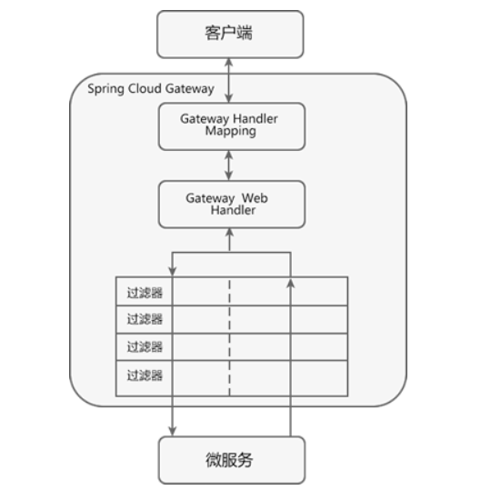
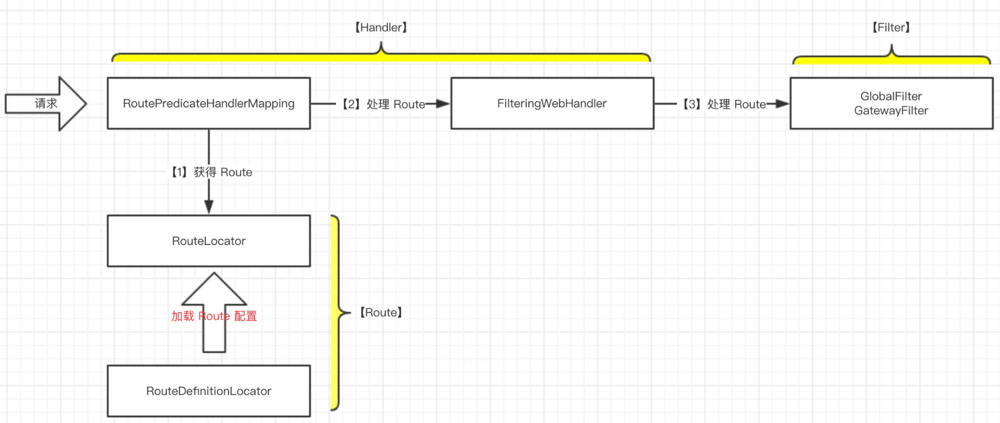
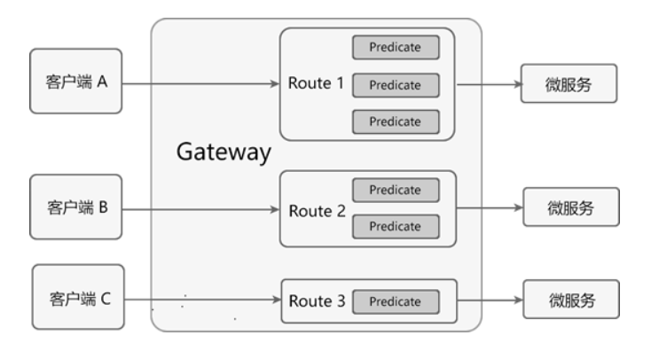

## 概述

参考文档：

http://c.biancheng.net/springcloud/gateway.html

> Base

Spring Cloud Gateway 是基于 `Spring 5.0`、`Spring Boot 2.0` 和`WebFlux`框架实现的，而 WebFlux 框架底层则使用了高性能的 Reactor 模式通信框架 Netty。

### 工作流程



1. 客户端将请求发送到Gateway上；
2. Gateway通过Gateway Handler Mapping找到请求相匹配的路由，将其发送到对应的Gateway Web Handler；
3. Gateway Web Handler通过指定的过滤器链（Filter Chain），将请求转发到实际的服务节点中，执行业务逻辑返回响应结果；
4. 过滤器之间用虚线分开是因为过滤器可能会在转发请求之前（pre）或之后（post）执行业务逻辑；
5. 过滤器（Filter）可以在请求被转发到服务端前，对请求进行拦截和修改，例如：参数校验，权限校验，流量监控，日志输出以及协议转换等；
6. 过滤器可以在响应返回客户端之前，对响应进行拦截和再处理，例如：修改响应内容，修改响应头，日志输出，流量监控等；
7. 响应原路返回给客户端。

> 组件交互



### Predicate 断言

Spring Cloud Gateway 通过 ==Predicate 断言来实现 Route 路由的匹配规则==。简单点说，Predicate 是路由转发的判断条件，请求只有==满足了 Predicate 的条件，才会被转发到指定的服务上==进行处理。



> 注意点

- Route 路由与 Predicate 断言的对应关系为“一对多”，一个路由可以包含多个不同断言。
- 一个请求想要转发到指定的路由上，就必须同时匹配路由上的所有断言。
- 当一个请求同时满足多个路由的断言条件时，请求只会被首个成功匹配的路由转发。

### Filter 过滤器

> 按类型划分

- Pre 类型  

  这种过滤器在**请求被转发到微服务之前**可以对请求进行拦截和修改，例如参数校验、权限校验、流量监控、日志输出以及协议转换等操作。

- Post 类型 

  这种过滤器**在微服务对请求做出响应后**可以对响应进行拦截和再处理，例如修改响应内容或响应头、日志输出、流量监控等。

> 按作用范围划分

- GatewayFilter：应用在单个路由或者一组路由上的过滤器。
- GlobalFilter：应用在所有的路由上的过滤器。

## 启动

spring-cloud-gateway-server配置文件spring.factories加载配置类：

```properties
# Auto Configure
org.springframework.boot.autoconfigure.EnableAutoConfiguration=\
org.springframework.cloud.gateway.config.GatewayClassPathWarningAutoConfiguration,\
org.springframework.cloud.gateway.config.GatewayAutoConfiguration,\
org.springframework.cloud.gateway.config.GatewayHystrixCircuitBreakerAutoConfiguration,\
org.springframework.cloud.gateway.config.GatewayResilience4JCircuitBreakerAutoConfiguration,\
org.springframework.cloud.gateway.config.GatewayLoadBalancerClientAutoConfiguration,\
org.springframework.cloud.gateway.config.GatewayNoLoadBalancerClientAutoConfiguration,\
org.springframework.cloud.gateway.config.GatewayMetricsAutoConfiguration,\
org.springframework.cloud.gateway.config.GatewayRedisAutoConfiguration,\
org.springframework.cloud.gateway.discovery.GatewayDiscoveryClientAutoConfiguration,\
org.springframework.cloud.gateway.config.SimpleUrlHandlerMappingGlobalCorsAutoConfiguration,\
org.springframework.cloud.gateway.config.GatewayReactiveLoadBalancerClientAutoConfiguration

org.springframework.boot.env.EnvironmentPostProcessor=\
org.springframework.cloud.gateway.config.GatewayEnvironmentPostProcessor

# Failure Analyzers
org.springframework.boot.diagnostics.FailureAnalyzer=\
org.springframework.cloud.gateway.support.MvcFoundOnClasspathFailureAnalyzer
```

### GatewayAutoConfiguration

网关开启配置：`spring.cloud.gateway.enabled`，默认开启。GatewayAutoConfiguration用来加载响应的Bean组件。

```java
@Configuration(proxyBeanMethods = false)
// 默认开启网关
@ConditionalOnProperty(name = "spring.cloud.gateway.enabled", matchIfMissing = true)
@EnableConfigurationProperties
// GatewayAutoConfiguration之后加载
@AutoConfigureBefore({ HttpHandlerAutoConfiguration.class, WebFluxAutoConfiguration.class })
// GatewayAutoConfiguration之前加载
@AutoConfigureAfter({ GatewayLoadBalancerClientAutoConfiguration.class, GatewayClassPathWarningAutoConfiguration.class })
@ConditionalOnClass(DispatcherHandler.class)
public class GatewayAutoConfiguration {
    
    // Netty实现的Client(封装了连接池ConnectionProvider)
    @Bean
    @ConditionalOnMissingBean
    public HttpClient gatewayHttpClient(HttpClientProperties properties, List<HttpClientCustomizer> customizers) {}

    @Bean
    @ConditionalOnEnabledGlobalFilter
    public NettyRoutingFilter routingFilter(HttpClient httpClient, ObjectProvider<List<HttpHeadersFilter>> headersFilters, HttpClientProperties properties) {
        return new NettyRoutingFilter(httpClient, headersFilters, properties);
    }

    @Bean
    @ConditionalOnEnabledGlobalFilter
    public NettyWriteResponseFilter nettyWriteResponseFilter(GatewayProperties properties) {
        return new NettyWriteResponseFilter(properties.getStreamingMediaTypes());
    }

    @Bean
    public ReactorNettyWebSocketClient reactorNettyWebSocketClient(HttpClientProperties properties, HttpClient httpClient) {
        ReactorNettyWebSocketClient webSocketClient = new ReactorNettyWebSocketClient(httpClient);
        if (properties.getWebsocket().getMaxFramePayloadLength() != null) {
            webSocketClient.setMaxFramePayloadLength(properties.getWebsocket().getMaxFramePayloadLength());
        }
        webSocketClient.setHandlePing(properties.getWebsocket().isProxyPing());
        return webSocketClient;
    }
    
    // ======================================= 分割线 ======================================= //
    
	// 全局过滤器GlobalFilter
    @Bean
	@ConditionalOnEnabledGlobalFilter
	public RouteToRequestUrlFilter routeToRequestUrlFilter() {
		return new RouteToRequestUrlFilter();
	}
    
    @Bean
	@ConditionalOnEnabledGlobalFilter
	public ForwardRoutingFilter forwardRoutingFilter(
			ObjectProvider<DispatcherHandler> dispatcherHandler) {
		return new ForwardRoutingFilter(dispatcherHandler);
	}
    
   
    
    // ======================================= 分割线 ======================================= //
    
    @Configuration(proxyBeanMethods = false)
    @ConditionalOnClass({ HystrixObservableCommand.class, RxReactiveStreams.class })
    protected static class HystrixConfiguration {

        @Bean
        @ConditionalOnEnabledFilter
        public HystrixGatewayFilterFactory hystrixGatewayFilterFactory(
            ObjectProvider<DispatcherHandler> dispatcherHandler) {
            return new HystrixGatewayFilterFactory(dispatcherHandler);
        }

        @Bean
        @ConditionalOnMissingBean(FallbackHeadersGatewayFilterFactory.class)
        @ConditionalOnEnabledFilter
        public FallbackHeadersGatewayFilterFactory fallbackHeadersGatewayFilterFactory() {
            return new FallbackHeadersGatewayFilterFactory();
        }

    }
}
```

### GatewayClassPathWarningAutoConfiguration

GatewayClassPathWarningAutoConfiguration在GatewayAutoConfiguration之前加载。作用主要是：检查依赖，检查项目是否正确导入 `spring-boot-starter-webflux` 依赖，而不是错误导入 `spring-boot-starter-web` 依赖。

```java
@Configuration(proxyBeanMethods = false)
@AutoConfigureBefore(GatewayAutoConfiguration.class)
@ConditionalOnProperty(name = "spring.cloud.gateway.enabled", matchIfMissing = true)
public class GatewayClassPathWarningAutoConfiguration {

   // 引入了spring-boot-starter-web依赖，报错
   @Configuration(proxyBeanMethods = false)
   @ConditionalOnClass(name = "org.springframework.web.servlet.DispatcherServlet")
   @ConditionalOnWebApplication(type = ConditionalOnWebApplication.Type.SERVLET)
   protected static class SpringMvcFoundOnClasspathConfiguration {
      public SpringMvcFoundOnClasspathConfiguration() {
         throw new MvcFoundOnClasspathException();
      }
   }

   @Configuration(proxyBeanMethods = false)
   @ConditionalOnMissingClass("org.springframework.web.reactive.DispatcherHandler")
   protected static class WebfluxMissingFromClasspathConfiguration {
      public WebfluxMissingFromClasspathConfiguration() {}
   }

}
```


