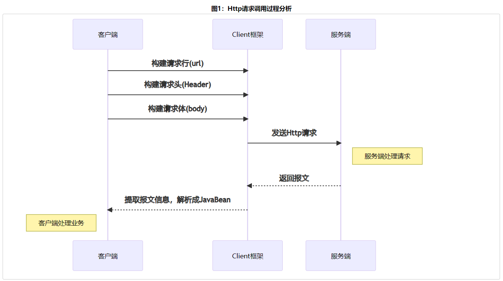
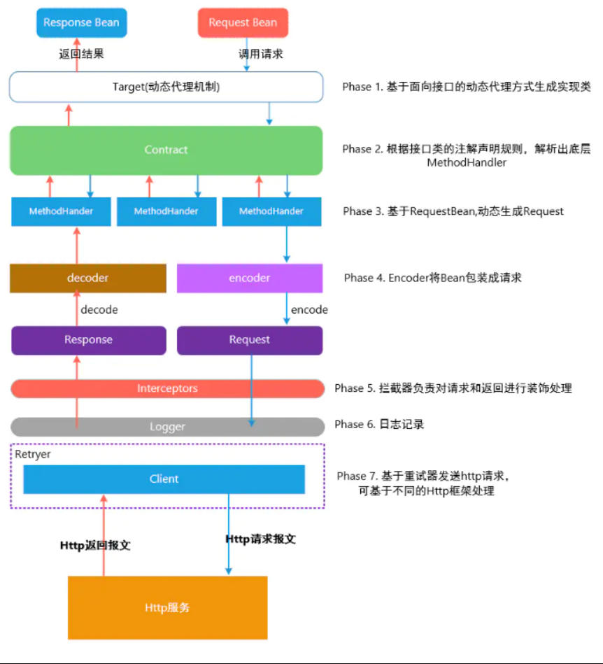
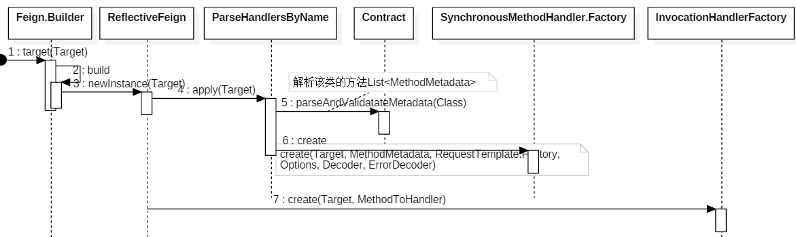

# OpenFeign

## About

- 官方文档

  https://docs.spring.io/spring-cloud-openfeign/docs/2.2.10.RELEASE/reference/html/

- 参看blog

  https://www.cnblogs.com/binarylei/p/11576147.html

## 概述

Feign封装HTTP调用流程，面向接口编程，并为很多的HTTP Client做了大量的适配工作。




> Feign整体设计

- 整体设计



1. 前两步是生成动态对象：将 Method 方法的注解解析成 MethodMetadata，并最终生成 Feign 动态代理对象。
2. 后几步是调用过程：根据解析的 MethodMetadata 对象，将 Method 方法的参数转换成 Request，最后调用 Client 发送请求。


> REST声明规范

其中 `Feign` 已经适配了 JAX-RS 1/2 和 Feign 自带的注解规范。`Spring Cloud Open Feign` 进一步适配了 Spring Web MVC 的注解规范。

| REST框架       | 使用场景                | 请求映射注解    | 请求参数      |
| -------------- | ----------------------- | --------------- | ------------- |
| JAX-RS         | 客户端声明、 服务端声明 | @Path           | @Param        |
| Feign          | 客户端声明              | @RequestLine    | @Param        |
| Spring Web MVC | 服务端声明              | @ReqeustMapping | @RequestParam |


> Feign的声明使用

```java
// 构建代理对象
GitHub github = Feign.builder()
    .encoder(new GsonDecoder())
    .decoder(new GsonEncoder())
    .errorDecoder(new GitHubErrorDecoder(decoder))
    .logger(new Logger.ErrorLogger())
    .logLevel(Logger.Level.BASIC)
    .requestInterceptor(template -> {
        if (System.getenv().containsKey(GITHUB_TOKEN)) {
            System.out.println("Detected Authorization token from environment variable");
            template.header(
                "Authorization",
                "token " + System.getenv(GITHUB_TOKEN));
        }
    })
    .target(GitHub.class, "https://api.github.com");

// 方法调用
github.contributors("openfeign", "some-unknown-project");
```

## 动态代理对象生成

目的：生成Target.type 的代理对象 proxy，这个代理对象就可以像访问普通方法一样发送 Http 请求，其实和 RPC 的 Stub 模型是一样的。了解 proxy 后，其执行过程其实也就一模了然。





- 生成动态代理对象的核心方法：

feign.Feign.Builder#target(java.lang.Class<T>, java.lang.String)

feign.Feign.Builder#target(feign.Target<T>)

```java
public <T> T target(Target<T> target) {
  return build().newInstance(target);
}

public <T> T target(Class<T> apiType, String url) {
    return target(new HardCodedTarget<T>(apiType, url));
}
```

### Target

```java
public interface Target<T> {
    // 接口的类型
    Class<T> type();

    // 代理对象的名称，默认为url,负载均衡时有用
    String name();

    // 请求的url地址，eg: https://api/v2
    String url();
}
```

### ReflectiveFeign

feign的默认实现ReflectiveFeign。当然我们可以通过`extend Feign.Builder`来重写`build()`方法，替换Feign的实现形式，如`feign.hystrix.HystrixFeign`。


> 构建ReflectiveFeign

feign.Feign.Builder#build

```java
public Feign build() {
    // client 有三种实现 JdkHttp/ApacheHttp/okHttp，默认是 jdk 的实现
    // RequestInterceptor 请求拦截器
    SynchronousMethodHandler.Factory synchronousMethodHandlerFactory =
        new SynchronousMethodHandler.Factory(client, retryer, requestInterceptors, logger,
                                             logLevel, decode404, closeAfterDecode, propagationPolicy);

    // Contract REST注解解析器，默认为 Contract.Default()，即支持 Feign 的原生注解。
    ParseHandlersByName handlersByName =
        new ParseHandlersByName(contract, options, encoder, decoder, queryMapEncoder,
                                errorDecoder, synchronousMethodHandlerFactory);

    // InvocationHandlerFactory 生成 JDK 动态代理，实际执行是委托给了 MethodHandler。
    return new ReflectiveFeign(handlersByName, invocationHandlerFactory, queryMapEncoder);
}
```


> 生成代理对象

feign.ReflectiveFeign#newInstance

```java
// creates an api binding to the target. As this invokes reflection, care should be taken to cache the result.
// 创建与target的 api 绑定。由于这会调用反射，因此应注意缓存结果
public <T> T newInstance(Target<T> target) {
  Map<String, MethodHandler> nameToHandler = targetToHandlersByName.apply(target);
  Map<Method, MethodHandler> methodToHandler = new LinkedHashMap<Method, MethodHandler>();
  List<DefaultMethodHandler> defaultMethodHandlers = new LinkedList<DefaultMethodHandler>();
  // 1. Contract 将 target.type 接口类上的方法和注解解析成 MethodMetadata，并转换成内部的MethodHandler处理方式
  for (Method method : target.type().getMethods()) {
    if (method.getDeclaringClass() == Object.class) {
      continue;
    } else if (Util.isDefault(method)) {
      DefaultMethodHandler handler = new DefaultMethodHandler(method);
      defaultMethodHandlers.add(handler);
      methodToHandler.put(method, handler);
    } else {
      methodToHandler.put(method, nameToHandler.get(Feign.configKey(target.type(), method)));
    }
  }
  // 2. 生成 target.type 的 jdk 动态代理对象
  InvocationHandler handler = factory.create(target, methodToHandler); // InvocationHandler委托给SynchronousMethodHandler.Factory创建, 传入methodToHandler
  T proxy = (T) Proxy.newProxyInstance(target.type().getClassLoader(),
                                       new Class<?>[] {target.type()}, handler);

  for (DefaultMethodHandler defaultMethodHandler : defaultMethodHandlers) {
    defaultMethodHandler.bindTo(proxy);
  }
  return proxy;
}
```

### MethodHandler 

由动态代理对象生成（`newInstance()`）可以知道，通过`ParseHandlersByName.apply` 可以生成了每个方法的执行器MethodHandler。

```java
Map<String, MethodHandler> nameToHandler = targetToHandlersByName.apply(target);
```


> apply

这个方法由以下几步：

1. Contract 统一将方法解析 MethodMetadata，这样就可以通过实现不同的 Contract 适配各种 REST 声明式规范。
2. buildTemplate 实际上将 Method 方法的参数转换成 Request。
3. 将 metadata 和 buildTemplate 封装成 MethodHandler。

feign.ReflectiveFeign.ParseHandlersByName#apply

```java
public Map<String, MethodHandler> apply(Target key) {
  // 1. contract解析代理类Target中的方法、参数和注解等，并生成MethodMetadata
  List<MethodMetadata> metadata = contract.parseAndValidatateMetadata(key.type());
  Map<String, MethodHandler> result = new LinkedHashMap<String, MethodHandler>();
  for (MethodMetadata md : metadata) {
    // 2. buildTemplate 实际上将请求Method方法的参数转换成 Request
    BuildTemplateByResolvingArgs buildTemplate;
    if (!md.formParams().isEmpty() && md.template().bodyTemplate() == null) {
      // 2.1 表单
      buildTemplate = new BuildFormEncodedTemplateFromArgs(md, encoder, queryMapEncoder);
    } else if (md.bodyIndex() != null) {
      // 2.2 @Body 注解
      buildTemplate = new BuildEncodedTemplateFromArgs(md, encoder, queryMapEncoder);
    } else {
      // 2.3 其余
      buildTemplate = new BuildTemplateByResolvingArgs(md, queryMapEncoder);
    }
    // 3. 将 metadata 和 buildTemplate 封装成 MethodHandler
    result.put(md.configKey(),
               factory.create(key, md, buildTemplate, options, decoder, errorDecoder));
  }
  return result;
}
```

## 调用过程

由上面可知，动态代理对象生成，并绑定了MethodHandler。当代理对象调用方法是就会调用proxy对象的`invoke()`方法，进而完成HTTP调用的过程。


### FeignInvocationHandler#invoke

动态代理对象的默认实现`feign.ReflectiveFeign.FeignInvocationHandler`。该方法执行的`invoke()`，实际上是委托给`SynchronousMethodHandler#invoke`执行。

```java
@Override
public Object invoke(Object proxy, Method method, Object[] args) throws Throwable {
  if ("equals".equals(method.getName())) {
    try {
      Object otherHandler =
        args.length > 0 && args[0] != null ? Proxy.getInvocationHandler(args[0]) : null;
      return equals(otherHandler);
    } catch (IllegalArgumentException e) {
      return false;
    }
  } else if ("hashCode".equals(method.getName())) {
    return hashCode();
  } else if ("toString".equals(method.getName())) {
    return toString();
  }
  // 委托给MethodHandler执行invoke方法，每个方法都对应一个MethodHandler。
  // MethodHandler是在生成proxy时存入dispatch，见：InvocationHandler handler = factory.create(target, methodToHandler);
  return dispatch.get(method).invoke(args);
}
```

###  SynchronousMethodHandler#invoke

该方法主要做：发起 http 请求，并根据 retryer 进行重试，具体执行委托给`executeAndDecode()`方法。

```java
@Override
public Object invoke(Object[] argv) throws Throwable {
  // template将argv参数构建成Request
  RequestTemplate template = buildTemplateFromArgs.create(argv);
  Options options = findOptions(argv);
  Retryer retryer = this.retryer.clone();
  while (true) {
    try {
      // 调用client.execute(request, options)
      return executeAndDecode(template, options);
    } catch (RetryableException e) {
      try {
        // 重试机制
        retryer.continueOrPropagate(e);
      } catch (RetryableException th) {
        Throwable cause = th.getCause();
        if (propagationPolicy == UNWRAP && cause != null) {
          throw cause;
        } else {
          throw th;
        }
      }
      if (logLevel != Logger.Level.NONE) {
        logger.logRetry(metadata.configKey(), logLevel);
      }
      continue;
    }
  }
}
```

> executeAndDecode

该方法主要做：一是编码生成Request；二是http请求；三是解码生成Response。

```java
Object executeAndDecode(RequestTemplate template, Options options) throws Throwable {
  // 1. 调用拦截器 RequestInterceptor，并根据 template 生成 Request
  Request request = targetRequest(template);

  if (logLevel != Logger.Level.NONE) {
    logger.logRequest(metadata.configKey(), logLevel, request);
  }

  Response response;
  long start = System.nanoTime();
  try {
    // 2. http 请求
    response = client.execute(request, options);
  } catch (IOException e) {
    if (logLevel != Logger.Level.NONE) {
      logger.logIOException(metadata.configKey(), logLevel, e, elapsedTime(start));
    }
    throw errorExecuting(request, e);
  }
  long elapsedTime = TimeUnit.NANOSECONDS.toMillis(System.nanoTime() - start);

  boolean shouldClose = true;
  try {
    if (logLevel != Logger.Level.NONE) {
      response =
          logger.logAndRebufferResponse(metadata.configKey(), logLevel, response, elapsedTime);
    }
    // 3. response 解码
    if (Response.class == metadata.returnType()) {
      if (response.body() == null) {
        return response;
      }
      if (response.body().length() == null ||
          response.body().length() > MAX_RESPONSE_BUFFER_SIZE) {
        shouldClose = false;
        return response;
      }
      // Ensure the response body is disconnected
      byte[] bodyData = Util.toByteArray(response.body().asInputStream());
      return response.toBuilder().body(bodyData).build();
    }
    if (response.status() >= 200 && response.status() < 300) {
      if (void.class == metadata.returnType()) {
        return null;
      } else {
        Object result = decode(response);
        shouldClose = closeAfterDecode;
        return result;
      }
    } else if (decode404 && response.status() == 404 && void.class != metadata.returnType()) {
      Object result = decode(response);
      shouldClose = closeAfterDecode;
      return result;
    } else {
      throw errorDecoder.decode(metadata.configKey(), response);
    }
  } catch (IOException e) {
    if (logLevel != Logger.Level.NONE) {
      logger.logIOException(metadata.configKey(), logLevel, e, elapsedTime);
    }
    throw errorReading(request, response, e);
  } finally {
    if (shouldClose) {
      ensureClosed(response.body());
    }
  }
}
```

> targetRequest

```java
Request targetRequest(RequestTemplate template) {
  for (RequestInterceptor interceptor : requestInterceptors) {
    interceptor.apply(template);
  }
  return target.apply(template);
}
```

### 引申Ribbon/Hystrix

> RibbonClient

Ribbon负载均衡实现是，创建RibbonClient，`client.excute()`时确定负载均衡。

```java
Feign.builder().client(RibbonClient.create()).target(Target.class,  url);
```

负载均衡：`feign.ribbon.RibbonClient#execute`


> HystrixClient

Hystrix限流降级实现是，feign调用时，即代理对象执行`invoke()`时，进行限流和降级。

创建HystrixClient：`feign.hystrix.HystrixFeign.Builder#target(java.lang.Class<T>, java.lang.String, feign.hystrix.FallbackFactory<? extends T>)`

限流与降级：`feign.hystrix.HystrixInvocationHandler#invoke`

## Contract

Contract用来解析方法的参数，并解析为 Http 的请求行、请求头、请求体，生成MethodMetadata信息，其作用是用来==适配Feign、JAX-RS 1/2 、Spring MVC的 REST 声明式注解==。

### 工作流程


前两步是 `Feign` 代理生成阶段，解析方法参数及注解元信息。后三步是调用阶段，将方法参数编码成 Http 请求的数据格式。

- contract提供解析MethodMeatadata的方法

```java
public interface Contract {
  /**
   * Called to parse the methods in the class that are linked to HTTP requests.
   *
   * @param targetType {@link feign.Target#type() type} of the Feign interface.
   */
  // TODO: break this and correct spelling at some point
  List<MethodMetadata> parseAndValidatateMetadata(Class<?> targetType);
}

public final class MethodMetadata implements Serializable {

  private static final long serialVersionUID = 1L;
  private String configKey; 					// 方法签名，类全限名+方法全限名
  private transient Type returnType;	// 方法返回值类型
  private Integer urlIndex;					// 方法参数为url时，为 urlIndex
  private Integer bodyIndex;				// 方法参数没有任务注解，默认为 bodyIndex
  private Integer headerMapIndex;		// @HeaderMap
  private Integer queryMapIndex;		// @QueryMap
  private boolean queryMapEncoded;
  private transient Type bodyType;
  // 初始化了RequestTemplate
  private RequestTemplate template = new RequestTemplate();	// 核心
  private List<String> formParams = new ArrayList<String>();
  private Map<Integer, Collection<String>> indexToName = new LinkedHashMap<Integer, Collection<String>>();
  private Map<Integer, Class<? extends Expander>> indexToExpanderClass = new LinkedHashMap<Integer, Class<? extends Expander>>();
  private Map<Integer, Boolean> indexToEncoded = new LinkedHashMap<Integer, Boolean>();
  private transient Map<Integer, Expander> indexToExpander;
}
```

- RequestTemplate创建Request

 RequestTemplate创建Request 后就可以供 `Client#execute()` 调用发送 Http 请求。

```java
public final class RequestTemplate implements Serializable {
  /**
   * Creates a {@link Request} from this template. The template must be resolved before calling this
   * method, or an {@link IllegalStateException} will be thrown.
   *
   * @return a new Request instance.
   * @throws IllegalStateException if this template has not been resolved.
   */
  public Request request() {
    if (!this.resolved) {
      throw new IllegalStateException("template has not been resolved.");
    }
    return Request.create(this.method, this.url(), this.headers(), this.requestBody());
  }
}

public interface Client {
    Response execute(Request request, Options options) throws IOException;
}
```

组装真正发起调用的RequestTemplate，解析Metadata创建的RequestTemplate的属性值，会转移到本次创建的RequestTemplate。

`feign.ReflectiveFeign.BuildTemplateByResolvingArgs#create`

```java
public RequestTemplate create(Object[] argv) {
  // 从metadata.template()获取属性，metadata.template的属性值在解析Metadata时已经赋值
  RequestTemplate mutable = RequestTemplate.from(metadata.template());
  
  // 1. 解析url参数
  if (metadata.urlIndex() != null) {
    int urlIndex = metadata.urlIndex();
    checkArgument(argv[urlIndex] != null, "URI parameter %s was null", urlIndex);
    mutable.target(String.valueOf(argv[urlIndex]));
  }
  
  // 2. 解析参数argv成对应的对象
  Map<String, Object> varBuilder = new LinkedHashMap<String, Object>();
  for (Entry<Integer, Collection<String>> entry : metadata.indexToName().entrySet()) {
    int i = entry.getKey();
    Object value = argv[entry.getKey()];
    if (value != null) { // Null values are skipped.
      if (indexToExpander.containsKey(i)) {
        value = expandElements(indexToExpander.get(i), value);
      }
      for (String name : entry.getValue()) {
        varBuilder.put(name, value);
      }
    }
  }

  // 3. @Body中的参数占位符
  RequestTemplate template = resolve(argv, mutable, varBuilder);
  
  // 4. @QueryMap
  if (metadata.queryMapIndex() != null) {
    // add query map parameters after initial resolve so that they take
    // precedence over any predefined values
    Object value = argv[metadata.queryMapIndex()];
    Map<String, Object> queryMap = toQueryMap(value);
    template = addQueryMapQueryParameters(queryMap, template);
  }

  // 5. @HeaderMap
  if (metadata.headerMapIndex() != null) {
    template = addHeaderMapHeaders((Map<String, Object>) argv[metadata.headerMapIndex()], template);
  }

  return template;
}
```

### Metadata解析


|  Feign 注解  |           MethodMetadata 中解析值            |
| :----------: | :------------------------------------------: |
|   @Headers   |           data.template().headers            |
| @RequestLine | data.template().method + data.template().uri |
|    @Body     |             data.template().body             |
|    @Param    |               data.indexToName               |
|  @QueryMap   |              data.queryMapIndex              |
|  @HeaderMap  |             data.headerMapIndex              |

#### parseAndValidatateMetadata

> 举个例子

```java
@Headers("Content-Type: application/json")
interface UserService {
    @RequestLine("POST /user")
    @Headers("Content-Type: application/json")
    @Body("%7B\"user_name\": \"{user_name}\", \"password\": \"{password}\"%7D")
    void user(@Param("user_name") String name, @Param("password") String password, 
              @QueryMap Map<String, Object> queryMap, 
              @HeaderMap Map<String, Object> headerMap, User user);
}
```

`parseAndValidatateMetadata` 作用：遍历解析 UserService 中的每个方法，按接口类上、方法上、参数上的注解，将其解析成 MethodMetadata。

主要注解：`@RequestLine` 、`@Headers` 、`@Body`、 `@Param`、 `@HeaderMap` 、`@QueryMap`

> 源码

feign默认的Metadata解析：`feign.Contract.BaseContract#parseAndValidatateMetadata(java.lang.Class<?>)`

```java
protected MethodMetadata parseAndValidateMetadata(Class<?> targetType, Method method) {
  MethodMetadata data = new MethodMetadata();
  data.returnType(Types.resolve(targetType, targetType, method.getGenericReturnType()));
  data.configKey(Feign.configKey(targetType, method));

  // 1. 解析类上的注解
  if (targetType.getInterfaces().length == 1) {
    processAnnotationOnClass(data, targetType.getInterfaces()[0]);
  }
  processAnnotationOnClass(data, targetType);

  // 2. 解析方法上的注解
  for (Annotation methodAnnotation : method.getAnnotations()) {
    processAnnotationOnMethod(data, methodAnnotation, method);
  }
  checkState(data.template().method() != null,
             "Method %s not annotated with HTTP method type (ex. GET, POST)",
             method.getName());
  Class<?>[] parameterTypes = method.getParameterTypes();
  Type[] genericParameterTypes = method.getGenericParameterTypes();

  Annotation[][] parameterAnnotations = method.getParameterAnnotations();
  int count = parameterAnnotations.length;
  for (int i = 0; i < count; i++) {
    // isHttpAnnotation 表示参数上是否有注解存在
    boolean isHttpAnnotation = false;
    if (parameterAnnotations[i] != null) {
      isHttpAnnotation = processAnnotationsOnParameter(data, parameterAnnotations[i], i);
    }
    // 方法参数上不存在注解
    if (parameterTypes[i] == URI.class) {
      data.urlIndex(i);
    } else if (!isHttpAnnotation && parameterTypes[i] != Request.Options.class) {
      // 已经设置过 @FormParam JAX-RS规范
      checkState(data.formParams().isEmpty(), "Body parameters cannot be used with form parameters.");
      
      // 已经设置过 bodyIndex，如 user(User user1, Person person)
      checkState(data.bodyIndex() == null, "Method has too many Body parameters: %s", method);
      
      data.bodyIndex(i);
      data.bodyType(Types.resolve(targetType, targetType, genericParameterTypes[i]));
    }
  }

  if (data.headerMapIndex() != null) {
    checkMapString("HeaderMap", parameterTypes[data.headerMapIndex()],
                   genericParameterTypes[data.headerMapIndex()]);
  }

  if (data.queryMapIndex() != null) {
    if (Map.class.isAssignableFrom(parameterTypes[data.queryMapIndex()])) {
      checkMapKeys("QueryMap", genericParameterTypes[data.queryMapIndex()]);
    }
  }

  return data;
}
```

#### processAnnotationOnClass

类上只有一个注解：`@Headers -> data.template().headers`

```java
protected void processAnnotationOnClass(MethodMetadata data, Class<?> targetType) {
  if (targetType.isAnnotationPresent(Headers.class)) {
    String[] headersOnType = targetType.getAnnotation(Headers.class).value();
    checkState(headersOnType.length > 0, "Headers annotation was empty on type %s.",
        targetType.getName());
    Map<String, Collection<String>> headers = toMap(headersOnType);
    headers.putAll(data.template().headers());
    data.template().headers(null); // to clear
    data.template().headers(headers);
  }
}
```

#### processAnnotationOnMethod

 方法上可能有三个注解：

1. `@RequestLine -> data.template().method + data.template().uri`
2. `@Body -> data.template().body`
3. `@Headers -> data.template().headers`

```java
protected void processAnnotationOnMethod(MethodMetadata data,
                                         Annotation methodAnnotation,
                                         Method method) {
  // 传入方法注解类型
  Class<? extends Annotation> annotationType = methodAnnotation.annotationType();
  
  // RequestLine
  if (annotationType == RequestLine.class) {
    String requestLine = RequestLine.class.cast(methodAnnotation).value();
    checkState(emptyToNull(requestLine) != null,
               "RequestLine annotation was empty on method %s.", method.getName());

    Matcher requestLineMatcher = REQUEST_LINE_PATTERN.matcher(requestLine);
    if (!requestLineMatcher.find()) {
      throw new IllegalStateException(String.format(
        "RequestLine annotation didn't start with an HTTP verb on method %s",
        method.getName()));
    } else {
      // 保存 HTTP METHOD
      data.template().method(HttpMethod.valueOf(requestLineMatcher.group(1)));
      // 保存 HTTP URL
      data.template().uri(requestLineMatcher.group(2));
    }
    data.template().decodeSlash(RequestLine.class.cast(methodAnnotation).decodeSlash());
    data.template().collectionFormat(RequestLine.class.cast(methodAnnotation).collectionFormat());

    // Body
  } else if (annotationType == Body.class) {
    String body = Body.class.cast(methodAnnotation).value();
    checkState(emptyToNull(body) != null, "Body annotation was empty on method %s.",
               method.getName());
    if (body.indexOf('{') == -1) {
      data.template().body(body);
    } else {
      data.template().bodyTemplate(body);
    }
    
    // Headers
  } else if (annotationType == Headers.class) {
    String[] headersOnMethod = Headers.class.cast(methodAnnotation).value();
    checkState(headersOnMethod.length > 0, "Headers annotation was empty on method %s.", method.getName());
    data.template().headers(toMap(headersOnMethod));
  }
}
```

#### processAnnotationsOnParameter

 参数上可能有三个注解：

1. `@Param-> data.indexToName`
2. `@QueryMap-> data.queryMapIndex`
3. `@HeaderMap-> data.headerMapIndex`

```java
protected boolean processAnnotationsOnParameter(MethodMetadata data,
                                                Annotation[] annotations,
                                                int paramIndex) {
  boolean isHttpAnnotation = false;
  for (Annotation annotation : annotations) {
    Class<? extends Annotation> annotationType = annotation.annotationType();
    // Param
    if (annotationType == Param.class) {
      Param paramAnnotation = (Param) annotation;
      String name = paramAnnotation.value();
      checkState(emptyToNull(name) != null, "Param annotation was empty on param %s.", paramIndex);
      nameParam(data, name, paramIndex);
      Class<? extends Param.Expander> expander = paramAnnotation.expander();
      if (expander != Param.ToStringExpander.class) {
        data.indexToExpanderClass().put(paramIndex, expander);
      }
      data.indexToEncoded().put(paramIndex, paramAnnotation.encoded());
      isHttpAnnotation = true;
      // 即不是@Headers和@Body上的参数，只能是formParams了
      if (!data.template().hasRequestVariable(name)) {
        data.formParams().add(name);
      }
      
      // QueryMap
    } else if (annotationType == QueryMap.class) {
      checkState(data.queryMapIndex() == null, "QueryMap annotation was present on multiple parameters.");
      data.queryMapIndex(paramIndex);
      data.queryMapEncoded(QueryMap.class.cast(annotation).encoded());
      isHttpAnnotation = true;
      
      // HeaderMap
    } else if (annotationType == HeaderMap.class) {
      checkState(data.headerMapIndex() == null, "HeaderMap annotation was present on multiple parameters.");
      data.headerMapIndex(paramIndex);
      isHttpAnnotation = true;
    }
  }
  return isHttpAnnotation;
}
```

# Spring Cloud OpenFeign

由上述分析可知，Spring Cloud OpenFeign目的，一方面是适配Spring MVC的REST声明式注解，另一方面加入Spring Cloud的其他组件的支持，如注册中心，配置中心等。

因此，Spring Cloud OpenFeign可以通过改写Feign和实现Contract等手段，来完成上述的目的。

## Feign 装配流程


Feign的两个装配入口：

### @EnableAutoConfiguration

@EnableAutoConfiguration会自动装配factories文件下的配置类。（/META-INF/spring.factories）

```properties
org.springframework.boot.autoconfigure.EnableAutoConfiguration=\
org.springframework.cloud.openfeign.ribbon.FeignRibbonClientAutoConfiguration,\
org.springframework.cloud.openfeign.hateoas.FeignHalAutoConfiguration,\
org.springframework.cloud.openfeign.FeignAutoConfiguration,\
org.springframework.cloud.openfeign.encoding.FeignAcceptGzipEncodingAutoConfiguration,\
org.springframework.cloud.openfeign.encoding.FeignContentGzipEncodingAutoConfiguration,\
org.springframework.cloud.openfeign.loadbalancer.FeignLoadBalancerAutoConfiguration
```

- `FeignAutoConfiguration`：自动装配`FeignContext`和`Targeter`，以及`Client`配置。
  - **FeignContext**：每个FeignClient的装配上下文，默认配置是FeignClientsConfiguration；
  - **Targeter**：两种实现
    - DefaultTargeter，直接调用Feign.Builder；
    - HystrixTargeter，调用HystrixFeign.Builder，开启熔断。
  - **Client**：自动装配 ApacheHttpClient，OkHttpClient，装配条件不满足，默认是 Client.Default。但这些 Client 都没有实现负载均衡。

- `FeignRibbonClientAutoConfiguration`：实现负载均衡，负载均衡是在Client这一层实现的（均被LoadBalancerFeignClient包装，实现负载均衡）。
  - **HttpClientFeignLoadBalancedConfiguration**：ApacheHttpClient实现负载均衡
  - **OkHttpFeignLoadBalancedConfiguration**：OkHttpClient实现负载均衡
  - **DefaultFeignLoadBalancedConfiguration**：Client.Default实现负载均衡

### @EnableFeignClients

`@EnableFeignClients` 注入 `FeignClientsRegistrar`，`FeignClientsRegistrar` 开启自动扫描，将包下 `@FeignClient` 标注的接口包装成 `FeignClientFactoryBean` 对象，最终通过 `Feign.Builder` 生成该接口的代理对象。而 `Feign.Builder` 的默认配置是 `FeignClientsConfiguration`，是在 `FeignAutoConfiguration` 自动注入的。

> **注意：** 熔断与限流是 `FeignAutoConfiguration` 通过注入 `HystrixTargeter` 完成的，而负载均衡是 `FeignRibbonClientAutoConfiguration` 注入的。

## Feign 自动装配

### FeignAutoConfiguration

#### FeignContext

FeignContext 是每个 Feign 客户端配置的上下文环境，会将初始化一个 Feign 的组件都在一个子 ApplicationContext 中初始化，从而隔离不同的 Feign 客户端。换名话说，不同名称的 @FeignClient 都会初始化一个子的 Spring 容器。

**注意：** 每个 Feign 客户端除了默认 FeignClientsConfiguration，还可以自定义配置类 FeignClientSpecification。

```java
@Autowired(required = false)
private List<FeignClientSpecification> configurations = new ArrayList<>();

@Bean
public FeignContext feignContext() {
   FeignContext context = new FeignContext();
   context.setConfigurations(this.configurations);
   return context;
}

public class FeignContext extends NamedContextFactory<FeignClientSpecification> {
	public FeignContext() {
		super(FeignClientsConfiguration.class, "feign", "feign.client.name");
	}
}
```

**总结：** FeignClientsConfiguration 是 Feign 的默认配置，可以通过 @EnableFeignClients 和 @FeignClient 修改默认配置。FeignClientsConfiguration 主要配置如下：

```java
@Configuration
public class FeignClientsConfiguration {
    @Bean
    @ConditionalOnMissingBean
    public Decoder feignDecoder() {
        return new OptionalDecoder(
            new ResponseEntityDecoder(new SpringDecoder(this.messageConverters)));
    }
    
    // 适配 Spring MVC 注解
    @Bean
    @ConditionalOnMissingBean
    public Contract feignContract(ConversionService feignConversionService) {
        return new SpringMvcContract(this.parameterProcessors, feignConversionService);
    }

    @Bean
    @Scope("prototype")
    @ConditionalOnMissingBean
    public Feign.Builder feignBuilder(Retryer retryer) {
        return Feign.builder().retryer(retryer);
    }
}
```

#### Targeter

Targeter 有两种实现：一是 DefaultTargeter，直接调用 Feign.Builder； 二是 HystrixTargeter，调用 HystrixFeign.Builder，开启熔断。

```java
@Configuration(proxyBeanMethods = false)
@ConditionalOnClass(name = "feign.hystrix.HystrixFeign")
protected static class HystrixFeignTargeterConfiguration {

   @Bean
   @ConditionalOnMissingBean
   public Targeter feignTargeter() {
      return new HystrixTargeter();
   }

}

@Configuration(proxyBeanMethods = false)
@ConditionalOnMissingClass("feign.hystrix.HystrixFeign")
protected static class DefaultFeignTargeterConfiguration {

   @Bean
   @ConditionalOnMissingBean
   public Targeter feignTargeter() {
      return new DefaultTargeter();
   }

}
```

- DefaultTargeter

```java
class DefaultTargeter implements Targeter {

   @Override
   public <T> T target(FeignClientFactoryBean factory, Feign.Builder feign,
         FeignContext context, Target.HardCodedTarget<T> target) {
      return feign.target(target);
   }

}
```

- HystrixTargeter

```java
class HystrixTargeter implements Targeter {

   @Override
   public <T> T target(FeignClientFactoryBean factory, Feign.Builder feign,
         FeignContext context, Target.HardCodedTarget<T> target) {
      if (!(feign instanceof feign.hystrix.HystrixFeign.Builder)) {
         return feign.target(target);
      }
      feign.hystrix.HystrixFeign.Builder builder = (feign.hystrix.HystrixFeign.Builder) feign;
      String name = StringUtils.isEmpty(factory.getContextId()) ? factory.getName()
            : factory.getContextId();
      SetterFactory setterFactory = getOptional(name, context, SetterFactory.class);
      if (setterFactory != null) {
         builder.setterFactory(setterFactory);
      }
      Class<?> fallback = factory.getFallback();
      if (fallback != void.class) {
         return targetWithFallback(name, context, target, builder, fallback);
      }
      Class<?> fallbackFactory = factory.getFallbackFactory();
      if (fallbackFactory != void.class) {
         return targetWithFallbackFactory(name, context, target, builder,
               fallbackFactory);
      }

      return feign.target(target);
   }
}
```

#### Client

`FeignAutoConfiguration`下，默认的`FeignClientsConfiguration`和`OkHttpFeignConfiguration`均是不实现负载均衡的Client。若要实现负载均衡，则需`FeignRibbonClientAutoConfiguration`。

### FeignRibbonClientAutoConfiguration

FeignRibbonClientAutoConfiguration 实现了负载均衡。==SpringClientFactory 实际是 RibbonClientFactory==，功能等同于 FeignContext，用于装配 Ribbon 的基本组件。

注意在 `FeignRibbonClientAutoConfiguration` 之上 import 了三个配置类，`HttpClientFeignLoadBalancedConfiguration`、`OkHttpFeignLoadBalancedConfiguration`、`DefaultFeignLoadBalancedConfiguration`。

```java
@ConditionalOnClass({ ILoadBalancer.class, Feign.class })
@ConditionalOnProperty(value = "spring.cloud.loadbalancer.ribbon.enabled",
                       matchIfMissing = true)
@Configuration(proxyBeanMethods = false)
@AutoConfigureBefore(FeignAutoConfiguration.class)
@EnableConfigurationProperties({ FeignHttpClientProperties.class })
// Order is important here, last should be the default, first should be optional
// see
// https://github.com/spring-cloud/spring-cloud-netflix/issues/2086#issuecomment-316281653
@Import({ HttpClientFeignLoadBalancedConfiguration.class,
         OkHttpFeignLoadBalancedConfiguration.class,
         DefaultFeignLoadBalancedConfiguration.class })
public class FeignRibbonClientAutoConfiguration {

    @Bean
    @Primary
    @ConditionalOnMissingBean
    @ConditionalOnMissingClass("org.springframework.retry.support.RetryTemplate")
    public CachingSpringLoadBalancerFactory cachingLBClientFactory(
        SpringClientFactory factory) {
        // cachingFactory 用于组装 FeignLoadBalancer
        return new CachingSpringLoadBalancerFactory(factory);
    }

    @Bean
    @Primary
    @ConditionalOnMissingBean
    @ConditionalOnClass(name = "org.springframework.retry.support.RetryTemplate")
    public CachingSpringLoadBalancerFactory retryabeCachingLBClientFactory(SpringClientFactory factory, LoadBalancedRetryFactory retryFactory) {
        // cachingFactory 用于组装 FeignLoadBalancer
        return new CachingSpringLoadBalancerFactory(factory, retryFactory);
    }

    @Bean
    @ConditionalOnMissingBean
    public Request.Options feignRequestOptions() {
        return LoadBalancerFeignClient.DEFAULT_OPTIONS;
    }

}
```

### EnableFeignClients 

从`@EnableFeignClients`的属性大致可以推断出，`FeignClientsRegistrar`会扫描`basePackages`包下的所有 `@FeignClient`注解的类，用`Feign.Builder`生成动态代理的 Bean 注入到 Spring 容器中。

```java
@Import(FeignClientsRegistrar.class)
public @interface EnableFeignClients {
    String[] basePackages() default {};			 // 包扫描路径
    Class<?>[] defaultConfiguration() default {};// 默认配置
}
```

#### FeignClientsRegistrar

```java
class FeignClientsRegistrar
    implements ImportBeanDefinitionRegistrar, ResourceLoaderAware, EnvironmentAware {
    @Override
    public void registerBeanDefinitions(AnnotationMetadata metadata, BeanDefinitionRegistry registry) {
        // 注册@EnableFeignClients#defaultConfiguration 默认配置类
        registerDefaultConfiguration(metadata, registry);
        // 扫描所有的 @FeignClient 注解
        registerFeignClients(metadata, registry);
    } 
}
```

> **registerDefaultConfiguration**

目的：将`@EnableFeignClients`标注的默认配置`defaultConfiguration`注入到容器中。

`FeignAutoConfiguration` 自动装配 `FeignContext` 时的 `List<FeignClientSpecification> configurations` 吗，就是将 `@EnableFeignClients` 和 `@FeignClient` 的 `configuration` 属性注册到 Spring 的容器中。

```java
private void registerClientConfiguration(BeanDefinitionRegistry registry, Object name, Object configuration) {
    // 这种类型FeignClientSpecification的Bean，供FeignContext自动装配使用
    BeanDefinitionBuilder builder = BeanDefinitionBuilder.genericBeanDefinition(FeignClientSpecification.class);
    builder.addConstructorArgValue(name);
    builder.addConstructorArgValue(configuration);
    registry.registerBeanDefinition(name + "." + FeignClientSpecification.class.getSimpleName(),
                                    builder.getBeanDefinition());
}
```

> **registerFeignClients**

registerFeignClients 将 @FeignClient 标注的接口装配成 FeignClientFactoryBean 注入到容器中。FeignClientFactoryBean#getObject 最终会调用 feign.target 生成最终的代理对象。

```java
public void registerFeignClients(AnnotationMetadata metadata, BeanDefinitionRegistry registry) {

    LinkedHashSet<BeanDefinition> candidateComponents = new LinkedHashSet<>();
    Map<String, Object> attrs = metadata.getAnnotationAttributes(EnableFeignClients.class.getName());
    // 扫描条件: @FeignClient
    AnnotationTypeFilter annotationTypeFilter = new AnnotationTypeFilter(FeignClient.class);
    final Class<?>[] clients = attrs == null ? null : (Class<?>[]) attrs.get("clients");

    // @EnableFeignClients没有标注client
    if (clients == null || clients.length == 0) {
        ClassPathScanningCandidateComponentProvider scanner = getScanner();
        scanner.setResourceLoader(this.resourceLoader);
        scanner.addIncludeFilter(new AnnotationTypeFilter(FeignClient.class));
        Set<String> basePackages = getBasePackages(metadata);
        // 扫描 basePackage 下的 @FeignClient 注解
        for (String basePackage : basePackages) {
            candidateComponents.addAll(scanner.findCandidateComponents(basePackage));
        }
    } else {
        // @EnableFeignClients标注了client加入candidateComponents等待加入bean, @EnableFeignClients(clients = StoreClient.class)
        for (Class<?> clazz : clients) {
            candidateComponents.add(new AnnotatedGenericBeanDefinition(clazz));
        }
    }

    for (BeanDefinition candidateComponent : candidateComponents) {
        if (candidateComponent instanceof AnnotatedBeanDefinition) {
            // verify annotated class is an interface
            AnnotatedBeanDefinition beanDefinition = (AnnotatedBeanDefinition) candidateComponent;
            AnnotationMetadata annotationMetadata = beanDefinition.getMetadata();
            Assert.isTrue(annotationMetadata.isInterface(), "@FeignClient can only be specified on an interface");

            Map<String, Object> attributes = annotationMetadata.getAnnotationAttributes(FeignClient.class.getCanonicalName());

            String name = getClientName(attributes);
            // 注册 @FeignClient 的配置内容
            registerClientConfiguration(registry, name, attributes.get("configuration"));
            // 将该接口通过 FeignClientFactoryBean 注入到容器中
            registerFeignClient(registry, annotationMetadata, attributes);
        }
    }
}

// 注册 FeignClientFactoryBean
private void registerFeignClient(BeanDefinitionRegistry registry,
                                 AnnotationMetadata annotationMetadata, Map<String, Object> attributes) {
    String className = annotationMetadata.getClassName();
    BeanDefinitionBuilder definition = BeanDefinitionBuilder
        .genericBeanDefinition(FeignClientFactoryBean.class);
    validate(attributes);
    definition.addPropertyValue("url", getUrl(attributes));
    definition.addPropertyValue("path", getPath(attributes));
    String name = getName(attributes);
    definition.addPropertyValue("name", name);
    String contextId = getContextId(attributes);
    definition.addPropertyValue("contextId", contextId);
    definition.addPropertyValue("type", className);
    definition.addPropertyValue("decode404", attributes.get("decode404"));
    definition.addPropertyValue("fallback", attributes.get("fallback"));
    definition.addPropertyValue("fallbackFactory", attributes.get("fallbackFactory"));
    definition.setAutowireMode(AbstractBeanDefinition.AUTOWIRE_BY_TYPE);

    String alias = contextId + "FeignClient";
    AbstractBeanDefinition beanDefinition = definition.getBeanDefinition();
    beanDefinition.setAttribute(FactoryBean.OBJECT_TYPE_ATTRIBUTE, className);

    // has a default, won't be null
    boolean primary = (Boolean) attributes.get("primary");

    beanDefinition.setPrimary(primary);

    String qualifier = getQualifier(attributes);
    if (StringUtils.hasText(qualifier)) {
        alias = qualifier;
    }
    // 生成FeignClientFactoryBean
    BeanDefinitionHolder holder = new BeanDefinitionHolder(beanDefinition, className, new String[] { alias });
    // 注册FeignClientFactoryBean
    BeanDefinitionReaderUtils.registerBeanDefinition(holder, registry);
}
```

### FeignClientFactoryBean

上述可知，Spring启动时解析注解 `@EnableFeignClients` 和 `@FeignClient` ，将其属性装配成 `FeignClientFactoryBean` 注入容器中。

我们知道 `FeignClientFactoryBean` 是 Spring 的 Bean 工厂类，通过其 `getObject()` 方法可以获取真正的 Bean。所以在 `getObject` 中一定可以看到类似 `feign.target` 生成动态代理对象的代码。

```java
@Override
public Object getObject() throws Exception {
    return getTarget();
}

/**
 * @param <T> the target type of the Feign client 目标代理对象类型
 * @return a {@link Feign} client created with the specified data and the context
 * information	
 */
<T> T getTarget() {
    // 1. FeignAutoConfiguration 自动装配 FeignContext
    FeignContext context = applicationContext.getBean(FeignContext.class);
    Feign.Builder builder = feign(context);

    // 2. 没有指定url，则一定是负载均衡
    if (!StringUtils.hasText(url)) {
        if (!name.startsWith("http")) {
            url = "http://" + name;
        }
        else {
            url = name;
        }
        url += cleanPath();
        // 生成负载均衡的代理对象
        return (T) loadBalance(builder, context, new HardCodedTarget<>(type, name, url));
    }
    
    // 3. url存在，不用负载均衡
    if (StringUtils.hasText(url) && !url.startsWith("http")) {
        url = "http://" + url;
    }
    String url = this.url + cleanPath();
    Client client = getOptional(context, Client.class);
    if (client != null) {
        if (client instanceof LoadBalancerFeignClient) {
            // not load balancing because we have a url,
            // but ribbon is on the classpath, so unwrap
            client = ((LoadBalancerFeignClient) client).getDelegate();
        }
        if (client instanceof FeignBlockingLoadBalancerClient) {
            // not load balancing because we have a url,
            // but Spring Cloud LoadBalancer is on the classpath, so unwrap
            client = ((FeignBlockingLoadBalancerClient) client).getDelegate();
        }
        builder.client(client);
    }
    
    // 4 FeignAutoConfiguration 自动装配 Targeter
    Targeter targeter = get(context, Targeter.class);
    // 调用 feign.target 生成动态代理
    return (T) targeter.target(this, builder, context, new HardCodedTarget<>(type, name, url));
}
```

**总结：** 至此，`@FeignClient` 标注的接口，最终通过 `targeter.target` 生成最终的代理对象。在 `FeignClientFactoryBean` 中有 2 个重要的对象 `FeignClient` 和 `Targeter`，这两个对象都是通过 `FeignAutoConfiguration` 自动注入的。

1. FeignClient 是所有 `@FeignClient` 的上下文环境，管理了 `Feign.Builder` 的所有配置。根据 `@FeignClient`（同一个服务）的 `contextId` 区分不同的上下文环境，每个环境都是一个子 Spring 容器，从而直到隔离不同 `@FeignClient` 的目的。`@FeignClient` 的默认配置是 `FeignClientsConfiguration`，但同时也可以通过 `@EnableFeignClients` 和 @FeignClient 的 configuration 属性进行修改。

   ```java
   // NamedContextFactory#getContext 会根据 name 创建一个 ApplicationContext
   // FeignContext.getInstance(this.contextId, type)，在本文中就是根据 contextId 区分
   protected AnnotationConfigApplicationContext getContext(String name) {
       if (!this.contexts.containsKey(name)) {
           synchronized (this.contexts) {
               if (!this.contexts.containsKey(name)) {
                   this.contexts.put(name, createContext(name));
               }
           }
       }
       return this.contexts.get(name);
   }
   ```

2. Targeter 可以实现整合 Hystrix，实现熔断与限流。


