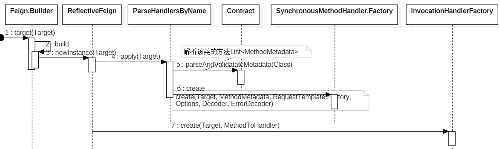

## About

- 官方文档

  https://docs.spring.io/spring-cloud-openfeign/docs/2.2.10.RELEASE/reference/html/

- 参看blog

  https://www.cnblogs.com/binarylei/p/11576147.html

## 概述

Feign封装HTTP调用流程，面向接口编程，并为很多的HTTP Client做了大量的适配工作。


> Feign整体设计

- 整体设计


1. 前两步是生成动态对象：将 Method 方法的注解解析成 MethodMetadata，并最终生成 Feign 动态代理对象。
2. 后几步是调用过程：根据解析的 MethodMetadata 对象，将 Method 方法的参数转换成 Request，最后调用 Client 发送请求。


- 调用时序图




> REST声明规范

其中 `Feign` 已经适配了 JAX-RS 1/2 和 Feign 自带的注解规范。`Spring Cloud Open Feign` 进一步适配了 Spring Web MVC 的注解规范。

| REST框架       | 使用场景                | 请求映射注解    | 请求参数      |
| -------------- | ----------------------- | --------------- | ------------- |
| JAX-RS         | 客户端声明、 服务端声明 | @Path           | @Param        |
| Feign          | 客户端声明              | @RequestLine    | @Param        |
| Spring Web MVC | 服务端声明              | @ReqeustMapping | @RequestParam |


> Feign的声明使用

```java
// 构建代理对象
GitHub github = Feign.builder()
    .encoder(new GsonDecoder())
    .decoder(new GsonEncoder())
    .errorDecoder(new GitHubErrorDecoder(decoder))
    .logger(new Logger.ErrorLogger())
    .logLevel(Logger.Level.BASIC)
    .requestInterceptor(template -> {
        if (System.getenv().containsKey(GITHUB_TOKEN)) {
            System.out.println("Detected Authorization token from environment variable");
            template.header(
                "Authorization",
                "token " + System.getenv(GITHUB_TOKEN));
        }
    })
    .target(GitHub.class, "https://api.github.com");

// 方法调用
github.contributors("openfeign", "some-unknown-project");
```

## 动态代理

生成动态代理对象的核心方法：

feign.Feign.Builder#target(java.lang.Class<T>, java.lang.String)

feign.Feign.Builder#target(feign.Target<T>)

```java
public <T> T target(Target<T> target) {
  return build().newInstance(target);
}

public <T> T target(Class<T> apiType, String url) {
    return target(new HardCodedTarget<T>(apiType, url));
}
```

### Target

```java
public interface Target<T> {
    // 接口的类型
    Class<T> type();

    // 代理对象的名称，默认为url,负载均衡时有用
    String name();

    // 请求的url地址，eg: https://api/v2
    String url();
}
```

### ReflectiveFeign

feign的默认实现ReflectiveFeign。当然我们可以通过`extend Feign.Builder`来重写`build()`方法，替换Feign的实现形式，如`feign.hystrix.HystrixFeign`。

位置：feign.Feign.Builder#build

```java
public Feign build() {
    // client 有三种实现 JdkHttp/ApacheHttp/okHttp，默认是 jdk 的实现
    // RequestInterceptor 请求拦截器
    SynchronousMethodHandler.Factory synchronousMethodHandlerFactory =
        new SynchronousMethodHandler.Factory(client, retryer, requestInterceptors, logger,
                                             logLevel, decode404, closeAfterDecode, propagationPolicy);

    // Contract REST注解解析器，默认为 Contract.Default()，即支持 Feign 的原生注解。
    ParseHandlersByName handlersByName =
        new ParseHandlersByName(contract, options, encoder, decoder, queryMapEncoder,
                                errorDecoder, synchronousMethodHandlerFactory);

    // InvocationHandlerFactory 生成 JDK 动态代理，实际执行是委托给了 MethodHandler。
    return new ReflectiveFeign(handlersByName, invocationHandlerFactory, queryMapEncoder);
}
```

> 


